# Algoritmo genético para replicación de imágenes estilizadas

Código de proyecto: GAFSIR (Genetic Algorithm for Stylized Image replication)

Franco Yudica

# Descripción

[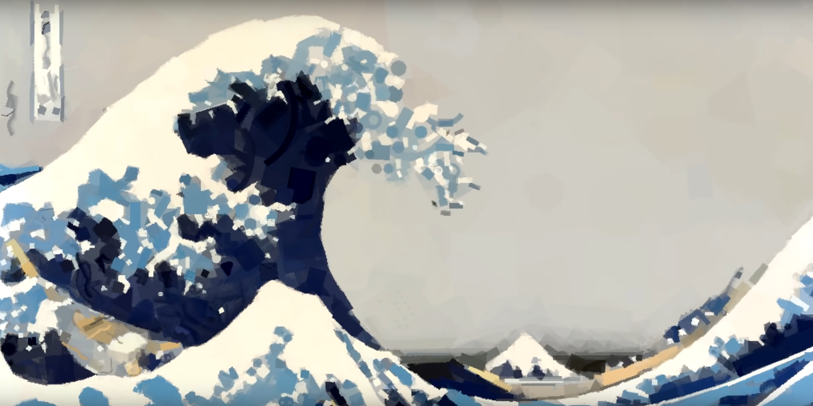](https://www.youtube.com/watch?v=6aXx6RA1IK4)

En este proyecto se busca desarrollar un método para generar imágenes _transformadas estéticamente_ utilizando técnicas de computación evolutivas. Al aplicar un algoritmo genético para replicar una imagen a través de modificaciones iterativas, se busca no solo aproximar la imagen original, sino también explorar una estética única, diferente a otras tales como las foto mosaicos, pointillism, pixelart, entre otros.

# Objetivos

Dada una _imagen objetivo_, el algoritmo debe ser capaz de generar una imagen, con características similares, tanto en las formas como en los colores y lo único que cambie sea la estética.

En este proyecto se implementarán dos enfoques para la generación de imágenes: uno basado en un _algoritmo aleatorio_, el cuál servirá como _baseline_, y otro utilizando un _algoritmo genético_. Para evaluar la calidad de las imágenes generadas, será esencial definir una métrica que mida la diferencia entre la imagen final generada por cada algoritmo y la imagen objetivo. A partir de los resultados, se determinará si el uso de algoritmos genéticos aporta ventajas significativas en el proceso de generación de imágenes.

# Alcance

En cuanto al alcance del proyecto, se limitará a la generación de una imagen. Es decir que el algoritmo toma como parámetro una imagen objetivo cualquiera, y generará una imagen estilizada.

Si los tiempos lo permiten, sería interesante implementar la replicación de videos. Esto supondría modificaciones en el código del algoritmo genético previamente desarrollado para la generación de imágenes.
Teniendo en cuenta que los fotogramas consecutivos suelen ser similares, es posible optimizar el algoritmo de generación de videos, utilizando los individuos de la imagen anterior.

# Limitaciones

El tiempo de ejecución es la mayor limitación. El procesamiento de imágenes involucra realizar operaciones por cada pixel de las mismas. Una imagen de tamaño 1920x1080(px) tiene un total de 2073600 pixeles y la función de fitness, como voy a detallar en su sección correspondiente, debe operar sobre todos estos pixeles.

Esto implica que en el desarrollo, las iteraciones para desarrollar el programa, sean lentas, aumentando los tiempos de desarrollo. Es por este motivo que considero vital la paralelización de los procesos de renderizado, utilizando la GPU, lo cuál aumentará la complejidad del programa.

# Métrica

La métrica utilizada para evaluar la similitud entre las imágenes será el algoritmo _Delta E (ΔE)_, aplicado en el espacio de color [CIE L*a*b\*](https://en.wikipedia.org/wiki/CIELAB_color_space). Este espacio es perceptualmente uniforme, lo que significa que las diferencias calculadas en él se corresponden mejor con la percepción humana de las variaciones de color.

El delta E es una medida estándar utilizada para cuantificar la diferencia entre dos colores en este espacio, y en este proyecto será clave para comparar la imagen generada con la imagen objetivo.

De esta forma, se podrá obtener una evaluación más precisa de la calidad de las imágenes generadas, ya que la métrica estará alineada con la percepción visual humana.

Con el objetivo de comparar los resultados de ambos algoritmos utilizando esta métrica, se evaluarán los siguientes escenarios:

- La métrica final obtenida al fijar una cantidad máxima de objetos.
- La cantidad de objetos necesarios para alcanzar una métrica objetivo específica.

# Algoritmo genético

Dadas dos imágenes, una llamada **imagen actual** y otra **imagen objetivo**, se busca encontrar el individuo que, al ser superpuesto o renderizado sobre la imagen actual, produzca una imagen que sea lo más similar posible a la imagen objetivo.

Nótese que el algoritmo genético se ejecutará múltiples veces para generar la imagen final. Esto está detallado en la sección de _Generación de la imagen_.

## Individuo

Los individuos cuentan con una serie de **atributos genéticos** que brindan suficiente flexibilidad para representar distintas formas y colores:

- **Textura**: El algoritmo genético toma como entrada un conjunto de texturas que serán utilizadas por los individuos. Cada individuo posee un atributo llamado textura, el cual corresponde a una de las texturas proporcionadas al algoritmo. Las texturas pueden asignarse a múltiples individuos, permitiendo su repetición dentro de la población.
- **Posición**: Vector bidimensional dominio _[0, N]x[0, M]_, donde _N_ es el ancho y _M_ el alto de la imagen objetivo. Determina la posición donde se renderizará la textura.
- **Tinte**: Es un color utilizado para _pintar_ la textura. Es vital para que los individuos tomen colores en función de su posición.
- **Escala**: Utilizado para modificar el tamaño de la textura. Por ejemplo, si una textura es de resolución _32x64px_ y la escala es 2, entonces la textura renderizada tendrá una resolución de _64x128px_. Importante cuando se intentan cubrir regiones de distinto tamaño.
- **Rotación**: La textura puede ser rotada [0, 2PI], teniendo como pivote el centro de la textura.

En definitiva, un individuo puede interpretarse como una sub-imagen que podrá contribuir en la imagen final.

## Función de fitness

La función de fitness, recibe como parámetro un indiduo y retorna un valor del intervalo [0.0, 1.0]. Donde el peor fitness posible es 0, y el mejor 1.

```c++
float fitness(individual) { ... }
```

Esta función realiza las siguientes tareas:

1. Renderiza el individuo sobre la imagen actual.

2. Renderiza la textura diferencia, con respecto a la imagen que se obtuvo en el paso 1 y la imagen objetivo. En esta textura, las componentes (R, G, B) contarán con las diferencias absolutas.
3. Lee la textura diferencia y calcula el error cuadrático medio entre la imagen objetivo y la actual.
4. Invierte el error cuadŕatico medio, obteniendo un valor normalizado [0, 1], correspondiente al fitness.

### Error cuadrático medio

<div align="center">
  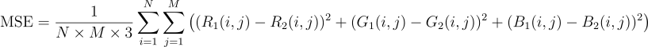
</div>

Donde:

- **N** y **M** son las dimensiones de la imagen.
- **R1(i,j)**, **G1(i,j)**, **B1(i,j)** son los valores de los canales Rojo, Verde y Azul de la imagen objetivo en el píxel **(i,j)**.
- **R2(i,j)**, **G2(i,j)**, **B2(i,j)** son los valores correspondientes en la imagen actual.
- El factor **3** en el denominador corresponde a los 3 canales (RGB) que se están promediando.
- De este modo, **MSE** será igual a 0 cuando las imágenes sean iguales y 1 cuando sean completamente distintas.

Luego, el fitness se calcula como:

<div align="center">
  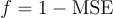
</div>

Esto se debe a que el fitness mide la similutid y no la diferencia.

### Ejemplo 1: Imágenes distintas

<div align="center" style="display: flex; align-items: center;">
  <div style="text-align: center; margin: 0 10px;">
    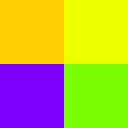
    <div>Target image</div>
  </div>
  <span style="font-size: 24px; margin: 0 10px;"> - </span>
  <div style="text-align: center; margin: 0 10px;">
    
    <div>Current image</div>
  </div>
  <span style="font-size: 24px; margin: 0 10px;"> = </span>
  <div style="text-align: center; margin: 0 10px;">
    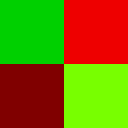
    <div>Absolute difference image</div>
  </div>
</div>

#### Los píxeles de la diferencia toman los siguientes valores (R, G, B):

| Posición   | Pixel diferencia absoluta |
| ---------- | ------------------------- |
| **(0, 0)** | (0.00, 0.81, 0.00)        |
| **(0, 1)** | (0.93, 0.00, 0.00)        |
| **(1, 0)** | (0.50, 0.00, 0.00)        |
| **(1, 1)** | (0.47, 1.00, 0.00)        |

#### Cálculo del error cuadŕatico medio

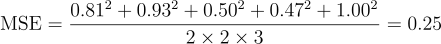

#### Cálculo de fitness

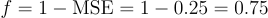

### Ejemplo 2: Imágenes similares

<div align="center" style="display: flex; align-items: center;">
  <div style="text-align: center; margin: 0 10px;">
    
    <div>Target image</div>
  </div>
  <span style="font-size: 24px; margin: 0 10px;"> - </span>
  <div style="text-align: center; margin: 0 10px;">
    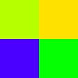
    <div>Current image</div>
  </div>
  <span style="font-size: 24px; margin: 0 10px;"> = </span>
  <div style="text-align: center; margin: 0 10px;">
    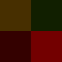
    <div>Absolute difference image</div>
  </div>
</div>

#### Los píxeles de la diferencia toman los siguientes valores (R, G, B):

| Posición   | Pixel diferencia absoluta |
| ---------- | ------------------------- |
| **(0, 0)** | (0.28, 0.18, 0.00)        |
| **(0, 1)** | (0.06, 0.11, 0.00)        |
| **(1, 0)** | (0.20, 0.00, 0.00)        |
| **(1, 1)** | (0.45, 0.00, 0.00)        |

#### Cálculo del error cuadŕatico medio

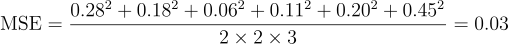

#### Cálculo de fitness

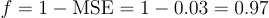

Nótese que es posible que imágenes completamente distintas obtengan el mismo valor de **f**, esto se debe a que las tres componentes son tratadas de igual manera.

### Justificación de MSE como algoritmo para calcular fitness

Como se mencioné previamente, la métrica de evaluación será delta E, calculada en el espacio de color CIELab. Aunque esta métrica ofrece una mayor precisión en la comparación perceptual de imágenes, es computacionalmente costosa. Utilizarla directamente como función de fitness ralentizaría significativamente el algoritmo.

He observado que en otros proyectos se emplea el error cuadrático medio (MSE) como función de fitness en algoritmos genéticos, logrando resultados satisfactorios.

Cabe aclarar que los inconvenientes asociados con el uso de MSE pueden mitigarse si los colores de los individuos son seleccionados adecuadamente, lo cual explicaré en detalle en la siguiente sección.

## Flujo del algoritmo

### Inicialización

Se mantendrá una población de tamaño fijo a lo largo de toda la ejecución del algoritmo. La población inicial estará formada por individuos con los siguientes
atributos aleatorizados:

- Textura
- Posición
- Escala
- Rotación

Nótese que el **tinte** de los individuos nunca será aleatorizado, esto será fundamental para reducir los tiempos de convergencia del algoritmo. En lugar de aleatorizar el tinte, se calculará el color promedio de la sub-imagen que ocupe el individuo, y se utilizará este color como tinte del individuo. Esto es sumamente importante y necesario, teniendo en cuenta que la función de fitness puede dar valores iguales para texturas con colores distintos.

### Operadores

#### Crossover

Dados dos padres, se realizarán interpolaciones lineales con pesos según su fitness sobre los atributos de posición, escala y rotación. En el caso de la textura, es imposible interpolarla, motivo por el cuál se seleccionará aleatoriamente una de las de los padres.

#### Mutación

Tanto la textura, como la posición, escala y rotación podrán mutar con cierta probabilidad. Nos permite aumentar la diversidad y explorar nuevas soluciones. La mutación será un operador fundamental.

#### Elitismo

Se utilizará elitismo sobre la población para no perder buenos individuos.

### Criterios de Finalización

- **Número máximo de generaciones**: El algoritmo se detendrá tras un número predefinido de generaciones, lo que permite limitar el tiempo de ejecución.

- **Convergencia**: Si el mejor individuo de la población no mejora su fitness después de un número determinado de generaciones consecutivas, se considerará que el algoritmo ha convergido y se detendrá.

- **Fitness objetivo**: Si el fitness del mejor individuo alcanza un valor suficientemente cercano al ideal (una diferencia mínima con respecto a la imagen objetivo), se dará por finalizado el proceso.

# Generación de la imagen

La imagen final se generará mediante iteraciones sucesivas y acumulativas del algoritmo genético.

### Algoritmo

1. Se crea una imagen negra, **Imagen<sub>0</sub>**, **Imagen<sub>i</sub>** = **Imagen<sub>0</sub>**.
2. Se ejecuta el algoritmo genético sobre **Imagen<sub>i</sub>**.
3. Se obtiene el mejor individuo y lo renderiza sobre **Imagen<sub>i</sub>**, obteniendo una nueva imagen **Imagen<sub>(i+1)</sub>**.
4. Si se cumple la **_condición de corte_**, la generación de la imagen termina.
5. Vuelve al paso 2, pero con **Imagen<sub>(i+1)</sub>**.

<p align="center">
  
  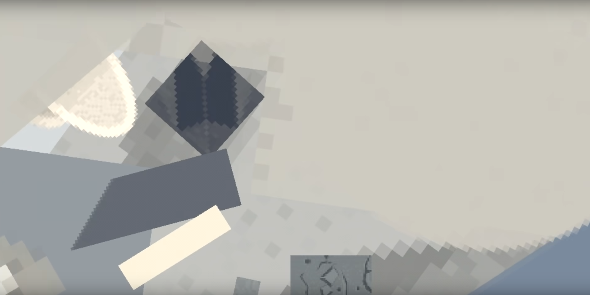
  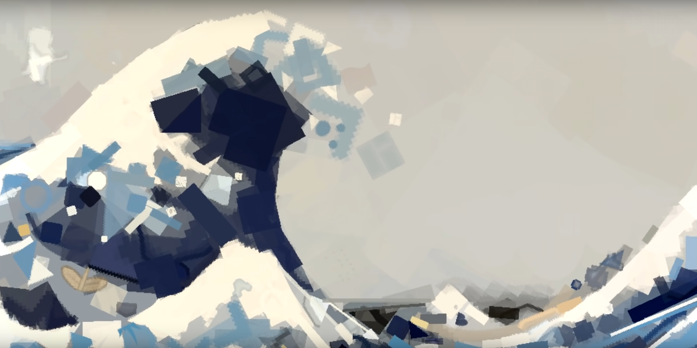
  
</p>

Como el individuo solo representa una de las sub-imágenes que componen al resultado, se realizarán múltiples ejeuciones del algoritmo genético, de tal modo que con cada ejecución, la imagen será cada vez más parecida a la objetivo.

En este proyecto, como he mencionado en la sección de _Métrica_, se evaluarán dos **_condiciones de corte_**.

- Cantidad máxima de objetos.
- Valor máximo de la métrica utilizada.

# Justificación

El problema a resolver, es de búsqueda local, no se busca la mejor solución porque esa mejor solución es la imagen objetivo, la cuál se ingresa como parámetro al algoritmo. Se busca un máximo (de similutud) local.
Considero que un algoritmo genético rendirá mejor en este problema que el algoritmo aleatorio porque mantiene diversidad, evitando caer en óptimos locales, además gracias al crossover y la mutación será posible ampliar más el espacio de soluciones y potencialmente descubriendo mejores soluciones.

Tras realizar investigaciones, un algoritmo de deep learning podría rendir mejor que un genético en este caso, pero no cuento con los conocimientos necesarios sobre el algoritmo, y el proyecto ya resulta ser desafiante con algoritmos genéticos.

Personalmente me resulta un proyecto muy interesante y desafiante en varios aspectos, lo que me da la motivación para poder encarar el problema. Además, me encantaría implementar la generación de videos, ya sea como el proyecto final de la materia o como proyecto personal.

# Listado de actividades

1. _Recopilación de bibliografía:_ 3 días
2. _Código fuente base:_ 3 días
3. _Implementación del renderizador:_ 2 días
4. _Implementación de la función de Fitness:_ 2 días
5. _Implementación de la métrica:_ 3 días
6. _Implementación de individuos y colores:_ 1 día
7. _Puesta a punto del código base:_ 3 días
8. _Integración del algoritmo aleatorio:_ 1 día
9. _Integración del algoritmo genético:_ 3 días
10. _Análisis de los resultados:_ 2 días
11. _Optimizaciones y mejoras:_ 4 días
12. _Recopilación de estadísticas:_ 2 días
13. _Escritura del informe:_ 7 días

Las actividades no son secuenciales, es decir que hay superposición de actividades.

# Cronograma estimado de actividades

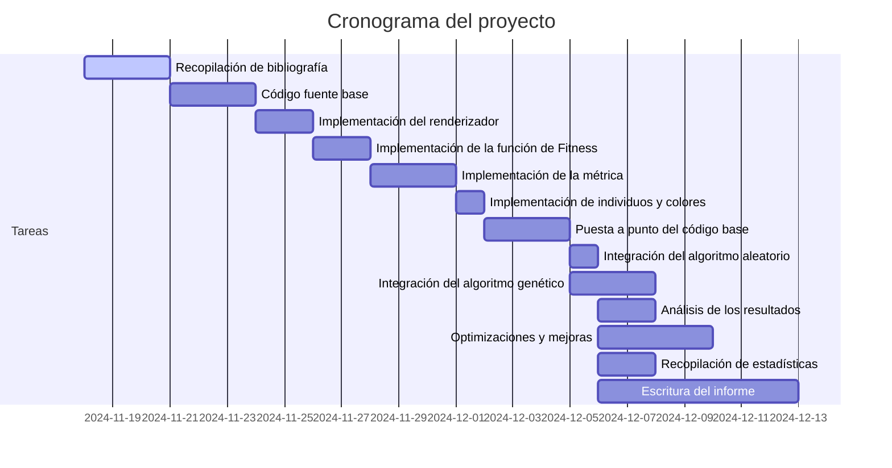

El cronograma de actividades estimado, comienza el día 18-11-2024, y termina el 16-12-2024, con un total de 29 días. El objetivo sería asistir al sexto llamado de mesas.

# Referencias

<a href="https://www.youtube.com/watch?v=6aXx6RA1IK4">Inspiración del proyecto</a>

Blibliografía:

- Artificial Intelligence A Modern Approach, Third Edition

- Introduction to Evolutionary Computing, Second Edition
- [What is Delta E? And Why Is It Important for Color Accuracy? ](https://www.viewsonic.com/library/creative-work/what-is-delta-e-and-why-is-it-important-for-color-accuracy/)
- [Formulación matemática de _delta e_](http://zschuessler.github.io/DeltaE/learn/)

Papers y proyectos:

- [Genetic algorithm for image recreation](https://medium.com/@sebastian.charmot/genetic-algorithm-for-image-recreation-4ca546454aaa). Utilización de _delta e_.

- [Grow Your Own Picture Genetic Algorithms & Generative Art](https://chriscummins.cc/s/genetics/#). Aplicación web para generar imagen con algoritmos genéticos.

- [Procedural paintings with genetic evolution algorithm](https://shahriyarshahrabi.medium.com/procedural-paintings-with-genetic-evolution-algorithm-6838a6e64703). Cálculo de métrica con _delta e_ sobre el espacio [_CIELab_](https://en.wikipedia.org/wiki/CIELAB_color_space), mismos atributos genéticos propuestos en este proyecto y paralelización con [_compute shaders_](https://www.khronos.org/opengl/wiki/Compute_Shader).

- [Genetic drawing](https://github.com/anopara/genetic-drawing). Código fuente para replicar imágenes como pinturas.

- [EllipScape: A Genetic Algorithm Based Approach to Non-Photorealistic Colored Image Reconstruction for Evolutionary Art](https://aisel.aisnet.org/cgi/viewcontent.cgi?article=1613&context=hicss-57). Algoritmo genético completamente distito, pero utiliza como función de fitness y métrica _Peak Signal-to-Noise_
  Ratio (PSNR). Se muestran resultados en cuanto a los tiempos de ejecución y como cambia la función de fitness a lo largo de las generaciones.
