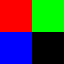

# Algoritmo genético para replicación de imágenes estilizadas

Código de proyecto: GAFSIR (Genetic Algorithm for Stylized Image replication)

Franco Yudica

# Descripción

El objetivo de este proyecto es desarrollar un método para generar imágenes _transformadas estéticamente_ utilizando técnicas de computación evolutivas. Al aplicar un algoritmo genético para replicar imágenes objetivo a través de modificaciones iterativas, se busca no solo aproximar la imagen original, sino también explorar interpretaciones visuales únicas. Este enfoque tiene como finalidad crear representaciones artísticas nuevas, evolucionando estructuras y patrones no convencionales, lo que da lugar a una estética distinta a los métodos tradicionales de replicación de imágenes, tales como los foto mosaicos, pointillism, pixelart, entre otros.

# Objetivos

El algoritmo debe ser capaz de replicar una imagen objetivo, tanto en las formas como en los colores, de tal modo de que sea interpretable y lo único que cambie sea la estética.

# Alcance

En cuanto al alcance del proyecto, se limitará a la generación de una imagen. Es decir que dada una imagen fuente, se obtendrá una imagen estilizada.

Si los tiempos lo permiten, sería interesante abordar la replicación de videos, lo cuál no debería resultar complejo, teniendo en cuenta que un video es una secuencia de imágenes, lo que permitiría reutilizar los algoritmos previamente desarrollados.

# Limitaciones

El tiempo de ejecución es la mayor limitación. El procesamiento de imágenes involucra realizar operaciones por cada pixel de las mismas. Una imagen de tamaño 1920x1080(px) tiene un total de 2073600 pixeles y la función de fitness, como voy a detallar en su sección correspondiente, debe operar sobre todos estos pixeles.

Esto implica que en el desarrollo, las iteraciones para desarrollar el programa, sean lentas, aumentando los tiempos de desarrollo. Es por este motivo que considero vital la paralelización de los procesos de renderizado, utilizando la GPU, lo cuál aumentará la complejidad del programa.

# Métrica

La métrica debe medir la diferencia entre dos imágenes, la objetivo y la "actual". Es de vital importancia que esta diferencia se corresponda a la diferencia percibida por el ojo humano.

# Algoritmo genético

El algoritmo genético tiene como entrada la imagen objetivo, la imagen actual y el dominio de imágenes que podrán tomar los individuos. Se retornará el individuo que resulte ser la mejor contribución sobre la imagen actual, con respecto a la imagen objetivo.

## Individuo

Un individuo cuenta con los siguientes atributos genéticos:

- Textura: Perteneciente al dominio de imágenes
- Tinte: La textura puede modularse con un color
- Posición: Del dominio _[0, N]x[0, M]_
- Escala
- Rotación

## Función de fitness

Se calcula como la media de la diferencia absolta por pixel.

  

Donde la imagen es de tamaño **NxM**, y cuenta con tres canales **(R, G, B)** y cada uno se encuentra en el intervalo **[0, 255]**. De este modo, **f** será igual a 0 cuando las imágenes sean iguales, y será 255 cuando sean completamente distintas. Finalmente, el valor será normalizado para definir el **fitness** en _[0.0, 1.0]_:

  

### Ejemplo 1: Imágenes distintas

  

    
    
Target image

  

   - 
  

    
    
Current image

  

   = 
  

    
    
Absolute difference image

  

#### Los píxeles de la diferencia toman los siguientes valores (R, G, B):

- **(0, 0)** = (0, 208, 0)
- **(0, 1)** = (238, 0, 0)
- **(1, 0)** = (128, 0, 0)
- **(1, 1)** = (120, 255, 0)

#### Cálculo de la suma de componentes

Al sumar todas las componentes y dividir por el total de canales, se obtiene:

Luego `F=0.6898`

### Ejemplo 2: Imágenes similares

  

    
    
Target image

  

   - 
  

    
    
Current image

  

   = 
  

    
    
Absolute difference image

  

#### Los píxeles de la diferencia toman los siguientes valores (R, G, B):

- **(0, 0)** = (72, 47, 0)
- **(0, 1)** = (17, 30, 0)
- **(1, 0)** = (52, 0, 0)
- **(1, 1)** = (116,0, 0)

#### Cálculo de la suma de componentes

Al sumar todas las componentes y dividir por el total de canales, se obtiene:

Luego `F=0.8908`

Nótese que es posible que imágenes completamente distintas obtengan el mismo valor de **F**, esto se debe a que las tres componentes son tratadas de igual manera.

## Flujo del algoritmo

### Inicialización

Se mantendrá una población de tamaño fijo a lo largo de toda la ejecución del algoritmo. La población inicial estará formada por individuos con los siguientes
atributos aleatorizados:

- Textura
- Posición
- Escala
- Rotación

Nótese que el tinte de los individuos nunca será aleatorizado, esto será fundamental para reducir los tiempos de convergencia del algoritmo. En lugar de aleatorizar el tinte, se calculará el color promedio de la sub-imagen que ocupe el individuo, y se utilizará este color como tinte del individuo. Esto es sumamente importante y necesario, teniendo en cuenta que la función de fitness puede dar valores iguales para texturas con colores distintos.

### Operadores

#### Crossover

Dados dos padres, se realizarán interpolaciones lineales con pesos según su fitness sobre los atributos de posición, escala y rotación. En el caso de la textura, es imposible interpolarla, motivo por el cuál se seleccionará aleatoriamente una de las de los padres.

#### Mutación

Tanto la textura, como la posición, escala y rotación podrán mutar con cierta probabilidad. Nos permite aumentar la diversidad y explorar nuevas soluciones. La mutación será un operador fundamental.

#### Elitismo

Se utilizará elitismo sobre cierto porcentaje de la población actual para no perder buenos individuos. El resto de los individuos será creado mediante el crossover.

# Generación de la imagen

Como ya detalle previamente, el algoritmo genético se encarga de buscar un individuo bueno para poder agregarlo a la imagen. Como el individuo solo representa una de las sub-imágenes que componen al resultado, se realizarán múltiples ejeuciones del algoritmo genético, de tal modo que con cada ejecución, la imagen será cada vez más parecida a la objetivo.

  
  
  
  

# Justificación

El problema a resolver, es de búsqueda local, no se busca la mejor solución porque esa mejor solución es la imagen objetivo, la cuál se ingresa como parámetro al algoritmo. Se busca un máximo (de similutud) local.
Considero un algoritmo genético rendirá mejor en este problema que hill climbing y simmulated annealing porque mantiene diversidad, evitando caer en óptimos locales, además gracias al crossover y la mutación será posible ampliar más el espacio de soluciones y potencialmente descubriendo mejores soluciones. Hill climbing es greedy y puede atascarse, y SA explora lentamente con una solución, los GA equilibran la exploración y la explotación de manera efectiva, haciéndolos más robustos para tareas complejas como la generación de imágenes.

Tras realizar investigaciones, un algoritmo de deep learning podría rendir mejor que un genético en este caso, pero no cuento con los conocimientos necesarios sobre el algoritmo, y el proyecto ya resulta ser desafiante con algoritmos genéticos.

Personalmente me resulta un proyecto muy interesante y desafiante en varios aspectos, lo que me da la motivación para poder encarar el problema.

# Referencias

<a href="https://www.youtube.com/watch?v=6aXx6RA1IK4">Inspiración del proyecto</a>

Artificial Intelligence A Modern Approach, Third Edition

Introduction to Evolutionary Computing, Second Edition
