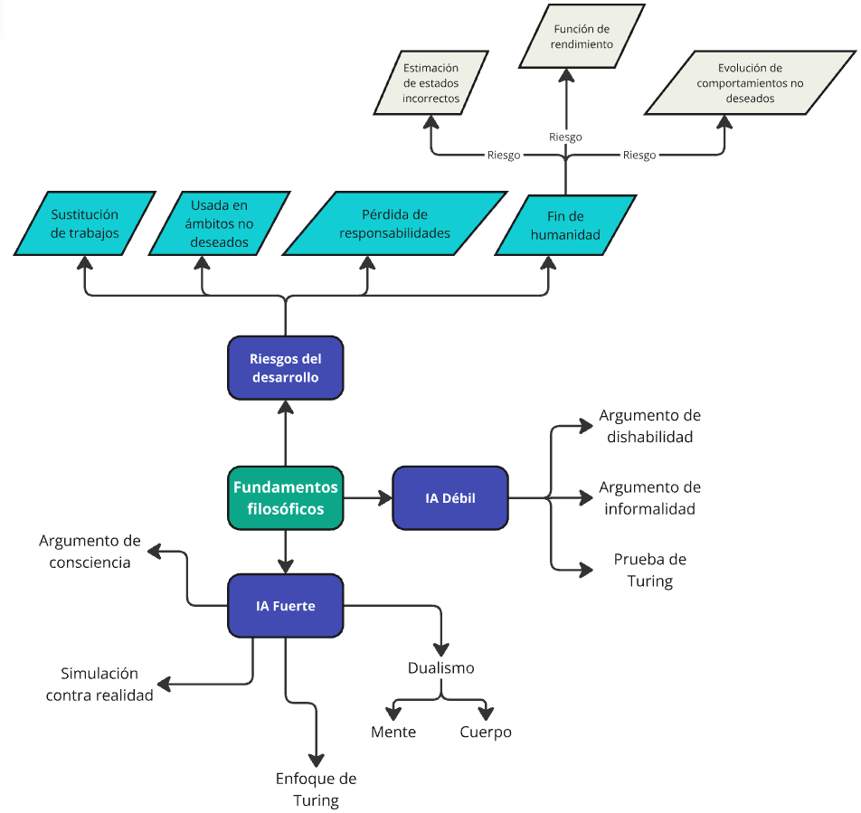

# Ejercicio 1

## Parte A
### Inteligencia artifical débil y fuerte
La hipótesis de que computadoras pueden <b>simular</b> ser inteligentes se denomina <b>hipótesis de inteligencia artifical débil</b>. Mientras que la hipótesis que sostiene que las computadoras que pueden pensar y no simular pensamiento, es denominada la <b>hipótesis de inteligencia artifical fuerte</b>

### 1. IA débil: Las computadoras pueden simular pensamiento?
Existen distintos puntos de vista respecto de si las computadoras piensan o no. Los filósofos suelen basarse en el propio significado de la palabra pensar, es decir que se manejan en términos conceptuales. Mientras que los investigadores suelen darle una mirada más práctica, de tal modo que la gran mayoría se basa en la hipótesis de inteligencia artifical débil, basándose en el estado de las inteligencias artificiales actuales.

#### Prueba de Turing
En los últimos 50 años hubieron múltiples intentos de desarrollar pruebas para evaluar la inteligencia de las computadoras y poder determinar cuando una computadora piensa.
Con gran diferencia, la prueba más usada es la <b>prueba de Turing</b>, que consiste en someter a una persona a una conversación con una inteligencia artifical durante 5 minutos. Con esta teoría, Turing sostiene que si las personas a prueba no pueden determinar que estan hablando con una inteligencia artifical por lo menos en el 30% de los casos, entonces la IA tiene consciecia.

#### Argumento de dishabilidad
Existen un montón de cosas que las computadoras  pueden hacer al nivel humano, e incluso mejor, tal como detectar patrones o jugar al ajedrez, pero hay muchasd cosas en las que fallan, y su rendimiento en tales tareas es inconparable con el de los humanos, tales como poder determinar el bien del mal, o pasar la prueba de turing.

#### El argumento de informalidad
El avance en IA está ocurriendo a pesar de los desafíos identificados por Dreyfus, y que una comprensión más completa de la inteligencia requiere considerar no solo el software, sino también la interacción física y el entorno del agente, apoyando la idea de que la cognición está incorporada y no puede separarse del cuerpo y del entorno, lo cuál resulta muy difícil de trasladarlo a una inteligencia artifical.

### 2. IA fuerte: Pueden las computadoras pensar?
Existen distintos puntos de vista sobre el pensamiento y las computadoras. Esto generó muchos debates y distintos puntos de vista:
- <b>Argumento de la Conciencia</b>: Geoffrey Jefferson, dice que para que una máquina realmente "piense", debe tener conciencia de sus propios estados mentales y emociones. Una máquina no solo debería simular pensamientos, sino también sentirlos.

- Turing sugiere que en lugar de enfocarse en si una máquina puede tener una conciencia verdadera, se puede seguir una convención social más pragmática: <i>simplemente aceptar que si una máquina actúa de manera inteligente, se le puede atribuir la capacidad de "pensar"</i>. Este enfoque evita profundizar en la cuestión de la conciencia real.

- <b>Simulación vs. Realidad</b>: John Searle argumenta que una simulación de procesos mentales no es lo mismo que tener procesos mentales reales. Esto es similar a cómo una simulación de tormenta no mojará a las personas, aunque pueda ser visualmente convincente. La cuestión es si una máquina que simula pensamientos realmente "piensa".

- <b>Dualismo</b>: René Descartes propuso que la mente y el cuerpo son dos entidades separadas. Esto plantea el problema de cómo una entidad no física (la mente) puede interactuar con una entidad física (el cuerpo).
- <b>Monismo o Fisicalismo</b>: La teoría monista, o fisicalismo, sostiene que la mente no está separada del cuerpo y los estados mentales son estados físicos. Esta teoría permite la posibilidad de que una máquina, en principio, pueda tener una mente si se asume que los estados físicos del cerebro (o de una máquina) pueden ser estados mentales.

## 3. Ética y riesgos de desarrollar inteligencia artifical
A lo largo de la historia, muchos desarrollos científicos aparentemente inofensivos han generado grandes impactos negativos en la sociedad y a nivel global. Hay que plantearnos si es posible que la inteligencia artificial es uno de estos desarrollos con consecuencias inesperadas, y si este fuera el caso entonces los desarrolladores deberían ser más cuidadosos con sus investifaciones y desarrollos.

- <b>Las personas podrían perder su trabajo al ser reemplazado por IA</b>. Como ya analizamos anteriormente, la inteligencia artifical puede hacer muchas tareas que las personas no, resulta más económico a largo plazo y se puede tener un trabajador 24 horas al día. Es indiscutible que desde el punto de vista empresarial, la incorporación de IA en sus tareas rutinarias es una mejora, implicando la pérdida de ciertos trabajos repetitivos.

- <b>La IA podría destinarse a usos no deseados</b>. La IA, puede ser utilizada por los poderosos para suprimir a sus rivales, lo que puede aumentar las desigualdades y causar destrucción. Un ejemplo es el uso de sistemas autónomos de IA en el campo de batalla, como los drones y vehículos terrestres autónomos desplegados por el ejército de EE.UU., que podrían llevar a decisiones erróneas, como la muerte de civiles inocentes, debido a la falta de intervención humana.

- <b>El uso de sistemas de inteligencia artificial podría resultar en una pérdida de responsabilidad</b>.
Anteriormente si un médico hacía un diagnóstico erroneo, entonces la culpa era completamente suya. Hoy en día se usa IA para poder mejorar las capacidades de diagnóstico y agilizar el proceso, y la responsabilidad recae en el médico. El principal problema se da cuando el médico (o cualquier profesional que utilize IA) se acostumbre al uso de la IA, generando gran confianza en los sistemas, los cuales no son infalibles, y en ciertas ocasiones pasando por alto cosas importantes.

- <b>El éxito de la IA podría implicar el final de la humanidad</b>
Muchas personas ceen que la IA en conjunto con la robótica podría causar un efecto grave en la humanidad, y se identifican tres fuentes principales de riezgo:
    1. <u>Estimación de estados incorrecta</u>: La IA se basa en una serie de estados para determinar que acción realizar. Si esta serie de estados es incorrecta, entonces las IA va a tomar acciones no deseadas, y en ciertas ocasiones con graves resultados. Un ejemplo claro se da en los autos autónomos, que están a cargo en gran medida no solo del transporte, sinó de la vida de una persona.
    2. <u>Función de utilidad o performance incorrecta</u>: La IA evalúa sus rultados con funciones de utilidad, las cuales deben ser definidas cuidadosamente. Un ejemplo exagerado, sería la de maximizar la felicidad de los humanos. Esta es difícil debido a que nunca vamos a ser 100% felices, y una IA podría llegar a la conclusión de que la inexistencia de humanos maximizaría tal función, buscando eliminar humanos.
    3. <u>Evolución de comportamientos no intencionados</u>. Está relacionada con el punto anterior, pero no se refiere necesariamente a la función de performance, sinó a cualquier motivo que genere tal evolución y su resultado final.

## Parte B
Mapa mental de los conceptos y relaciones

## Parte C
En general entiendo los distintos puntos de vista planteados en el libro, realmente es un tema que da para muchísimo debate.
Creo que decir si la inteligencia arificial es realmente débil o fuerte, es un concepto que cae sobre la filosofía, pero con un gran conocimiento técnico de los procesos que hacen las IA. Hoy en día no tengo una opinión muy marcada, creo que es algo que voy a poder consolidar a lo largo del tiempo, en función de experiencias con estos sistemas. Pero puedo decir que hoy en día creo en la hipótesis de la inteligencia artifical débil, principalmente por el estado actual de la IA. 
Me resulta muy interesante la prueba de Turing, en esto si estoy de acuerdo, pero creo que para que sea una prueba correcta, todas las personas deben ser engañadas, no solo un sector de la sociedad. Con el estado actual de los modelos de lenguaje, estoy completamente seguro de que varias personas no han podido detectar la diferencia entre el modelo y una persona. Pero probablemente, no estén al tanto de cuáles son los factores característicos de las salidas de estos modelos, principalmente por no haberlos utilizado previamente, o no tener conocimientos técnicos. Considero que la prueba de Turing, tal cuál como está dada, ya fue superada probablemente hace tiempo, pero la IA todavía no se ha ganado la "consciencia". Personalmente agregaría la condición de que para cualquier persona, sin importar el ámbito cultural o de especialización laboral, caiga por lo menos el 50% de las veces.

Algo muy importante, es priorizar el cuidado a lo largo del desarrollo sobre la rápida creación de nuevos modelos. En la sección de "fin de humanidad" aparecen tres riesgos, que deberían considerarse en todo momento. Entiendo que logar esto es algo difícil. En un nivel empresarial individual no sería tan complicado, pero cuando pasamos a un nivel multi-empresarial donde hay altos niveles de competencia que buscan maximizar sus ganancias y sobrepasar a los competidores en el menor tiempo posible, creo que es muchísimo más complicado. Creo que nos lleva a algo similar en cuanto a los movimientos sobre el cambio climático, y de igual manera, requiere intervención estatal y gran participación de la sociedad. Nos encontramos con IA en todos los ámbitos de nuestra vida, pero usualmente de manera invisible. Cuando sea mucho mas visible, como la conducción autónoma, y realmente esté integrada en nuestra "vida visible", la sociedad se va a enfocar realmente en el correcto desarrollo de IA.

# Ejercicio 2
### ¿Es posible considerar a los agentes conversacionales basados en grandes modelos de lenguaje (LLMs) como conscientes?
No creo que denominarlos conscientes sea apropiado cuando realmente son un conjunto de frios algoritmos estadísticos que tratan de replicar las salidas tomando como fuente una enorme cantidad de datos. Según la definición de la consciencia, la cuál esta asociada al comportamiento humano, la IA no es consciente. Pero si tomamos una mirada distinta como la de Wittgenstein y redefinimos el concepto de conscienca, entonces podríamos decur que si. Al final de cuentas, es algo que depende de la definición que tomamos y simplemente estamos categorizando.
Creo que es importante analizar estos temas, pero desde mi punto de vista, muchas personas tratan de buscar semejanzas entre los humanos y las computadoras, cuando en realidad los modelos son drásticamente distintos, y me parece fundamental tener bien clara la diferencia entre ambos.

### ¿Cuáles son las implicaciones éticas de atribuir conciencia y, por ende, "derechos morales" a los agentes de IA avanzados? 
Al día de hoy, no estoy de acuerdo con esto, pero siguiendo con esta línea de pensamiento, si en algún punto de la historia se logra la igualdad entre la humanidad y la IA, y la gran mayoría de la sociedad está de acuerdo con estas medidas, entonces la aparición de derechos no me parecería mal.
- Igualdad: ¿Cuál resulta la diferencia entre los humanos y la IA? La definición de distintos tipos de derechos resultaría muy dificil si no los consideramos como exactamente iguales.
- Derechos: Si le atribuimos derchos a las IA, en función de los derechos otorgados, podrían darse casos donde se pongan los derechos de las IA sobre las personas. Aunque parezca loco, en este contexto no sería imposible, debido a que se considera a la IA y la humanidad como semejantes.
- Responsabilidades: Hoy en día las responsabilidades caen sobre los usuarios y/o los creadores de la IA. ¿Pero los consideramos como seres conscientes e independientes, entonces la responsabilidad caería sobre la IA, en lugar de sus creadores?.

# Ejercicio 3
"No eres un loro", es una de las principales preocupaciones de Emily M. Bender. La linguista, deja en claro su preocupacion y su postura en dicho articulo. Recalca la importancia de observar la distincion de los humanos, junto con la humanidad que poseemos, contra a lo que ella llama "loros". Además, toca los temas de la importancia del controlor del desarrollo de las IA, y como la falta del mismo podria desencadenar en varios problemas etico-legales.

Tomando la idea de que las LLMs no son más que un algoritmo estadistico que, compone oraciones y simula su entendimientos, es una definicion acertada; sin embargo, muchas de las concluciones a las que llega, carecen de sentido logico, argumentos y hasta logra contradecirse en diversas ocaciones. En primer lugar, se hace mencion de la importancia del componente humano en la linguistica y en la sociedad, siendo de esta manera casi imposible replicar con una IA al comportamiento humano, siendo expresado en la analogia del pulpo. De esta manera, comenta que la brecha entre un LLMs y un humano, no solo es muy amplia sino, obvia. Siguiendo esta linea de pensamiento, todo lo mencionado acerca de la problematica de la deshumanizacion, mencionado con el ejemplo de la muñeca y el abuso de la misma, cae en una falasia ya que, partiendo de su analisis esta nunca estuvo cerca de hacerse pasar por un "humano falso".