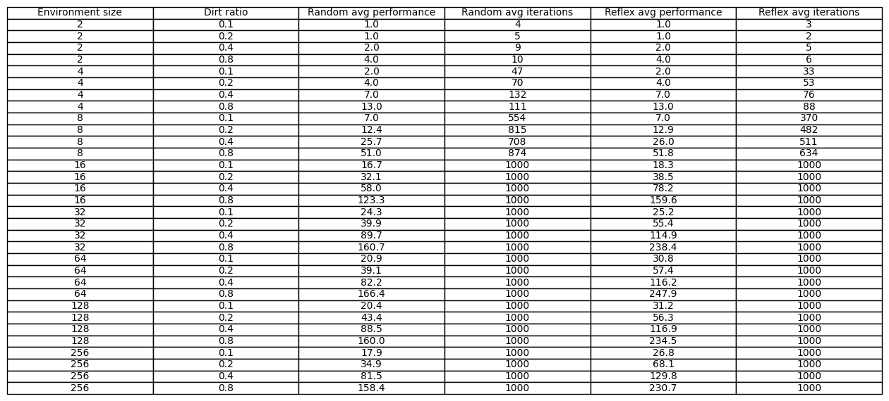

# Resultados
En esta sección se presentan los datos obtenidos tras realizar múltiples simulaciones con diferentes parámetros.
Los datos se obtuvieron tras ejecutar cada combinación de tamaño y porcentaje de suciedad, 10 simulaciones con cada agente.

Ilustraciones generadas con <b>matplotlib</b>
## Tabla con todos los resultados
 Es decir que los resultados mostrados en <b>Random agent</b> y <b>Simple reflex agent</b> son el promedio de tales simulaciones.

## Gráficos
En los siguientes gráficos, se ha fijado el porcentaje de suciedad y se relaciona el tamaño del entorno en el eje horizontal, con el rendimiento del agente en el eje vertical.

Nótese que el tamaño del entorno crece exponencialmente. Para simplificar la visualización y poder entender la diferencia entre los resulados con mayor claridad, se ha utilizado una escala logarítmica.
.png)
.png)
.png)
.png)

## Box and Whiskers
Para cada combinación de los parámetros de tamaño del entorno y porcentaje de suciedad, se realizaron 10 simulaciones con cada agente. A continuación se muestran los resultados con el gráfico de caja y exensiones, comparando a los agentes para cada configuración.
### Tamaño 8
_dr(0.1).png)
_dr(0.2).png)
_dr(0.4).png)
_dr(0.8).png)

### Tamaño 16
_dr(0.1).png)
_dr(0.2).png)
_dr(0.4).png)
_dr(0.8).png)

### Tamaño 32
_dr(0.1).png)
_dr(0.2).png)
_dr(0.4).png)
_dr(0.8).png)

### Tamaño 64
_dr(0.1).png)
_dr(0.2).png)
_dr(0.4).png)
_dr(0.8).png)

### Tamaño 128
_dr(0.1).png)
_dr(0.2).png)
_dr(0.4).png)
_dr(0.8).png)

### Tamaño 256
_dr(0.1).png)
_dr(0.2).png)
_dr(0.4).png)
_dr(0.8).png)
