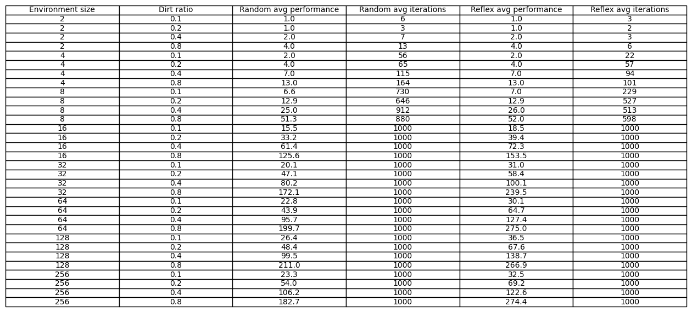

# Introducción
El objetivo de este proyecto es implementar un simulador que determine la medida de rendimiento de distintos agentes en el famoso entorno de la aspiradora. A continuación vamos a medir y comparar el desempeño de un agente reflexivo simple y de un agente aleatorio.

# Marco teórico y problema
Los agentes utilizan PEAS (Performance, Environment, Actions and Sensors), lo que significa que existe una métrica para medir el rendimiento, un entorno y los agentes pueden tomar acciones en función de los datos que muestren los sensores.


El entorno es una grilla de NxN celdas. Cada celda puede estar **limpia** o **sucia**. La tarea de la aspiradora es limpiar la suciedad presente en estas celdas.

- **Medida de desempeño**: La métrica usada para medir el desempeño es la cantidad de celdas limpiadas.
- **Entorno**: Grilla de celdas, limpias o sucias, parcialmente observable.
- **Acciones**: El agente puede moverse en las 4 direcciones, en caso de que no se salga del entorno. Además puede limpiar la celda en la que se encuentra, o no hacer nada.
- **Sensores**: El agente cuenta con un único sensor, que le permite saber si la celda sobre la que está posicionado está sucia.

# Diseño experimental
En este experimento se compararon los dos agentes sobre entornos de dimensión NxN, siendo N un número natural dentro del conjunto [2, 4, 8, 16, 32, 64, 128, 256]. Además para cada tamaño seleccionado se evaluó el rendimiento de los agentes sobre el entorno con diferentes porcentajes de suciedad, [0.1, 0.2, 0.4, 0.8].

Por cada combinación <b>(<i>tamaño</i>, <i>porcentaje_suciedad</i>)</b>, se evaluaron 10 simulaciones, con el objetivo de obtener una métrica promedio de cada agente por cada combinación, siendo esta métrica, más descriptiva que si solo se evaluara una sola vez.

Los entornos sobre los cuales se evaluaron los rendimientos para los distintos agentes, son completamente aleatorios, pero fueron los mismos para cada combinación de <b>(<i>tamaño</i>, <i>porcentaje_suciedad</i>)</b>. De esta forma ponemos a prueba a agentes distintos en igualdad de condiciones. Además, la posición inicial de los agentes es aleatoria.


# Análisis y discución de los resultados
Para obtener los siguientes resultados, la cantidad de iteraciones máxima por cada simulación fue limitada a 1000.
Ilustraciones generadas con <b>matplotlib</b>, y son automáticamente guardadas tras ejecutar el script ```measure_performances.py```

## Tabla con todos los resultados
A continuación se puede ver una tabla que resume todos los resultados obtenidos. Se observa por fila, el tamaño del entorno, el porcentaje de suciedad, y para cada agente la medida de rendimiento, en conjunto con la cantidad de iteraciones realizadas.



Nótese que a partir de los entornos de tamaño 16x16, la cantidad de iteraciones siempre es 1000. Esto se debe a que las iteraciones estan limitadas a este número, y en promedio los agentes no van a poder limpiar el entorno en 1000 iteraciones o menos.

## Gráficos
Debido al crecimiento exponencial del tamaño del entornos, he decidido, para simplificar la visualización y poder entender la diferencia entre los resulados con mayor claridad, utilizar una escala logarítmica.

### Performance
En los siguientes gráficos, se ha fijado el porcentaje de suciedad y se relaciona el tamaño del entorno en el eje horizontal, con el rendimiento del agente en el eje vertical.
Se puede observar que las gráficas, que son discretas, presentan una concavidad positiva en los entornos de tamaño [2, 8] y una concavidad negativa en [16, 256], siendo el punto de inflexión el tamaño 16. Esto está diréctamente relacionado con el límite de las iteraciones, y es por esto que si aumentamos el tamaño del entorno indefinidamente, nos encontramos con una "cota superor" del rendimiento promedio.
.png)
.png)
.png)
.png)

### Iteraciones
En el siguiente gráfico he fijado el porcentaje de suciedad en 0.4. Se puede ver relacionado el tamaño del entorno y la cantidad de iteraciones promedio requeridas para poder limpiar completamente el entorno.
.png)

Se puede observar que la cantidad de iteraciones promedio llega a las 1000 a partir de el tamaño 2⁴, debido a la limitación de iteraciones impuesta.


## Caja y extensiones
Para cada combinación de los parámetros de tamaño del entorno y porcentaje de suciedad, se realizaron 10 simulaciones con cada agente. A continuación se muestra la distribución del rendimiento obtenido en cada iteración mediante un gráfico de caja y extensiones.

.png)
.png)

He seleccionado dimensiones mayores a 8 porque en esos casos, los agentes siempre limpian todo el entorno, lo cuál significa que no hay dispersión de los datos, y el gráfico de caja y extensiones se ve colapsado en un solo valor.

Además, es evidente que la dispersión de los datos es mayor a medida que aumenta el porcentaje de suciedad, lo cuál se debe a que cada vez hay más casillas sucias, haciendo que el rango de posibles casillas limpiadas sea cada vez más grande.

## Conclusión

En función de los resultados obtenidos, es evidente que el agente reflexivo simple es mejor en términos de rendimiento e iteraciones que el agente aleatorio. Esto se debe a que el agente aleatorio simplemente selecciona acciones de forma puramente aleatoria, sin preguntarse si la casilla sobre la que está posicionado está sucia o no, mientras que el reflexivo simple si lo hace.