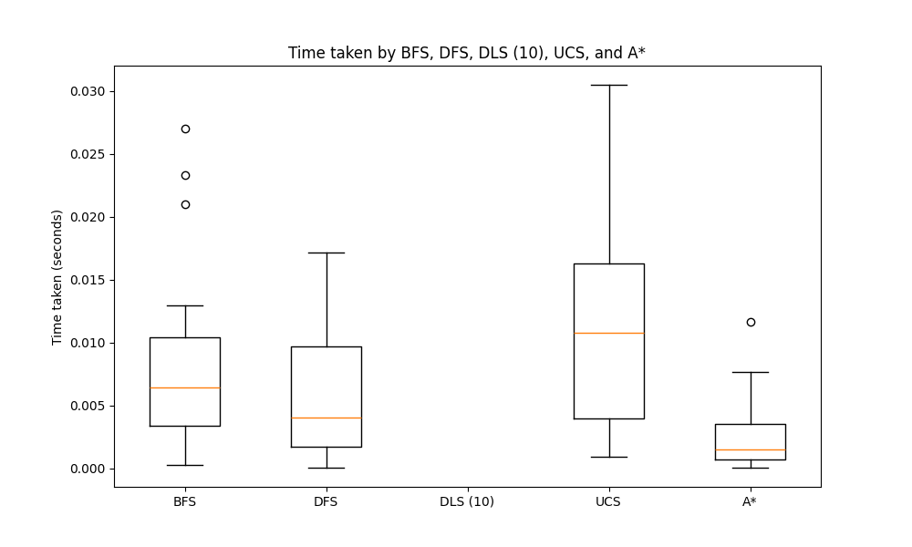
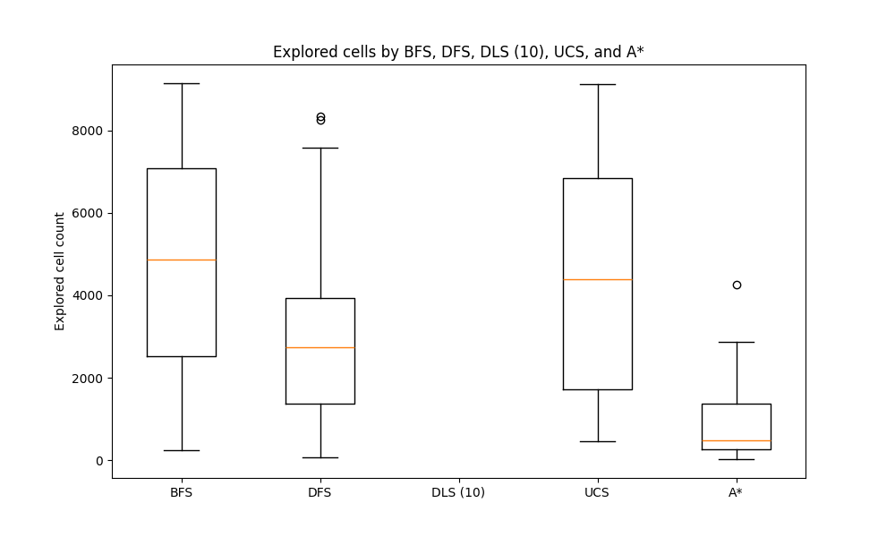
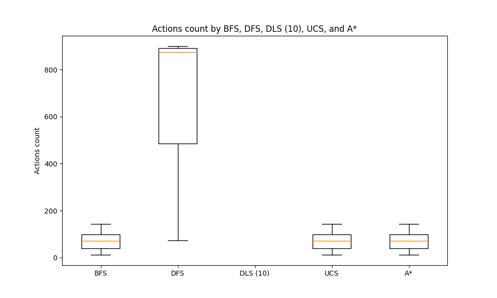

## Tabla con los resultados de las simulaciones
| algorithm_name | env_n | states_n | actions_count | actions_cost | time | solution_found |
| ---------------- | ------- | ---------- | --------------- | -------------- | ------ | ---------------- |
| BFS | 1 | 7058 | 100 | 112 | 0.009865283966064453 | True |
| BFS | 2 | 9147 | 144 | 224 | 0.013238906860351562 | True |
| BFS | 3 | 1299 | 38 | 111 | 0.0015938282012939453 | True |
| BFS | 4 | 8153 | 98 | 137 | 0.011347055435180664 | True |
| BFS | 5 | 6747 | 71 | 230 | 0.010635137557983398 | True |
| BFS | 6 | 1358 | 28 | 69 | 0.0017588138580322266 | True |
| BFS | 7 | 7080 | 98 | 305 | 0.009639263153076172 | True |
| BFS | 8 | 6096 | 73 | 210 | 0.00803995132446289 | True |
| BFS | 9 | 4089 | 50 | 69 | 0.005361795425415039 | True |
| BFS | 10 | 4434 | 56 | 92 | 0.007137775421142578 | True |
| BFS | 11 | 4497 | 76 | 247 | 0.01844620704650879 | True |
| BFS | 12 | 4590 | 54 | 96 | 0.006077289581298828 | True |
| BFS | 13 | 5159 | 57 | 147 | 0.006708383560180664 | True |
| BFS | 14 | 8903 | 104 | 258 | 0.017557859420776367 | True |
| BFS | 15 | 6819 | 94 | 206 | 0.00894308090209961 | True |
| BFS | 16 | 8507 | 133 | 359 | 0.02285933494567871 | True |
| BFS | 17 | 2684 | 39 | 54 | 0.0034945011138916016 | True |
| BFS | 18 | 2477 | 39 | 131 | 0.0036139488220214844 | True |
| BFS | 19 | 7627 | 103 | 248 | 0.02402043342590332 | True |
| BFS | 20 | 921 | 30 | 110 | 0.001087188720703125 | True |
| BFS | 21 | 3758 | 74 | 80 | 0.004868030548095703 | True |
| BFS | 22 | 6530 | 75 | 150 | 0.008464813232421875 | True |
| BFS | 23 | 4349 | 61 | 197 | 0.0055141448974609375 | True |
| BFS | 24 | 8422 | 124 | 391 | 0.010793685913085938 | True |
| BFS | 25 | 2228 | 43 | 94 | 0.0027780532836914062 | True |
| BFS | 26 | 8378 | 118 | 259 | 0.01085662841796875 | True |
| BFS | 27 | 232 | 12 | 47 | 0.0002722740173339844 | True |
| BFS | 28 | 1614 | 32 | 38 | 0.0020265579223632812 | True |
| BFS | 29 | 857 | 30 | 36 | 0.0010156631469726562 | True |
| BFS | 30 | 6680 | 93 | 305 | 0.008398771286010742 | True |
| DFS | 1 | 3463 | 122 | 162 | 0.005228519439697266 | True |
| DFS | 2 | 180 | 178 | 296 | 0.0001735687255859375 | True |
| DFS | 3 | 6753 | 898 | 2121 | 0.024393558502197266 | True |
| DFS | 4 | 2433 | 148 | 247 | 0.0037162303924560547 | True |
| DFS | 5 | 7582 | 897 | 2120 | 0.012332439422607422 | True |
| DFS | 6 | 469 | 444 | 975 | 0.0004756450653076172 | True |
| DFS | 7 | 2965 | 0 | 0 | 0.005436420440673828 | False |
| DFS | 8 | 5234 | 807 | 1884 | 0.021663904190063477 | True |
| DFS | 9 | 4039 | 872 | 1951 | 0.006324052810668945 | True |
| DFS | 10 | 3028 | 882 | 1908 | 0.004220247268676758 | True |
| DFS | 11 | 3457 | 894 | 2133 | 0.0050640106201171875 | True |
| DFS | 12 | 396 | 386 | 832 | 0.0003905296325683594 | True |
| DFS | 13 | 5192 | 0 | 0 | 0.008009195327758789 | False |
| DFS | 14 | 2310 | 792 | 1824 | 0.0058443546295166016 | True |
| DFS | 15 | 1467 | 900 | 2020 | 0.0018737316131591797 | True |
| DFS | 16 | 3598 | 885 | 2089 | 0.005169868469238281 | True |
| DFS | 17 | 3103 | 857 | 1922 | 0.004308462142944336 | True |
| DFS | 18 | 4250 | 0 | 0 | 0.006768703460693359 | False |
| DFS | 19 | 1326 | 887 | 1988 | 0.0016398429870605469 | True |
| DFS | 20 | 1699 | 0 | 0 | 0.002790212631225586 | False |
| DFS | 21 | 75 | 74 | 80 | 8.559226989746094e-05 | True |
| DFS | 22 | 1482 | 879 | 1908 | 0.0019023418426513672 | True |
| DFS | 23 | 8262 | 899 | 2109 | 0.012633800506591797 | True |
| DFS | 24 | 3045 | 0 | 0 | 0.00484919548034668 | False |
| DFS | 25 | 3623 | 0 | 0 | 0.005632877349853516 | False |
| DFS | 26 | 6957 | 0 | 0 | 0.010737895965576172 | False |
| DFS | 27 | 986 | 888 | 1963 | 0.000978231430053711 | True |
| DFS | 28 | 1510 | 892 | 1948 | 0.0018646717071533203 | True |
| DFS | 29 | 8343 | 610 | 1306 | 0.012405157089233398 | True |
| DFS | 30 | 4734 | 0 | 0 | 0.020992517471313477 | False |
| DLS (10) | 1 | 53 | 0 | 0 | 9.369850158691406e-05 | False |
| DLS (10) | 2 | 81 | 0 | 0 | 0.00010323524475097656 | False |
| DLS (10) | 3 | 51 | 0 | 0 | 7.176399230957031e-05 | False |
| DLS (10) | 4 | 53 | 0 | 0 | 6.937980651855469e-05 | False |
| DLS (10) | 5 | 66 | 0 | 0 | 8.96453857421875e-05 | False |
| DLS (10) | 6 | 52 | 0 | 0 | 7.200241088867188e-05 | False |
| DLS (10) | 7 | 71 | 0 | 0 | 9.059906005859375e-05 | False |
| DLS (10) | 8 | 76 | 0 | 0 | 9.846687316894531e-05 | False |
| DLS (10) | 9 | 73 | 0 | 0 | 9.465217590332031e-05 | False |
| DLS (10) | 10 | 61 | 0 | 0 | 7.867813110351562e-05 | False |
| DLS (10) | 11 | 80 | 0 | 0 | 9.989738464355469e-05 | False |
| DLS (10) | 12 | 82 | 0 | 0 | 0.00010466575622558594 | False |
| DLS (10) | 13 | 73 | 0 | 0 | 9.918212890625e-05 | False |
| DLS (10) | 14 | 52 | 0 | 0 | 6.747245788574219e-05 | False |
| DLS (10) | 15 | 89 | 0 | 0 | 0.00011515617370605469 | False |
| DLS (10) | 16 | 51 | 0 | 0 | 6.341934204101562e-05 | False |
| DLS (10) | 17 | 52 | 0 | 0 | 6.842613220214844e-05 | False |
| DLS (10) | 18 | 47 | 0 | 0 | 6.127357482910156e-05 | False |
| DLS (10) | 19 | 56 | 0 | 0 | 7.271766662597656e-05 | False |
| DLS (10) | 20 | 64 | 0 | 0 | 8.153915405273438e-05 | False |
| DLS (10) | 21 | 50 | 0 | 0 | 6.532669067382812e-05 | False |
| DLS (10) | 22 | 60 | 0 | 0 | 7.724761962890625e-05 | False |
| DLS (10) | 23 | 50 | 0 | 0 | 6.461143493652344e-05 | False |
| DLS (10) | 24 | 28 | 0 | 0 | 3.600120544433594e-05 | False |
| DLS (10) | 25 | 88 | 0 | 0 | 0.00011157989501953125 | False |
| DLS (10) | 26 | 72 | 0 | 0 | 9.083747863769531e-05 | False |
| DLS (10) | 27 | 58 | 0 | 0 | 7.319450378417969e-05 | False |
| DLS (10) | 28 | 50 | 0 | 0 | 6.532669067382812e-05 | False |
| DLS (10) | 29 | 67 | 0 | 0 | 8.726119995117188e-05 | False |
| DLS (10) | 30 | 87 | 0 | 0 | 0.00011086463928222656 | False |
| UCS | 1 | 1339 | 100 | 112 | 0.0036246776580810547 | True |
| UCS | 2 | 8180 | 144 | 224 | 0.022321701049804688 | True |
| UCS | 3 | 2234 | 38 | 111 | 0.004786968231201172 | True |
| UCS | 4 | 4073 | 98 | 137 | 0.010799646377563477 | True |
| UCS | 5 | 8697 | 71 | 230 | 0.020807981491088867 | True |
| UCS | 6 | 1434 | 28 | 69 | 0.0031080245971679688 | True |
| UCS | 7 | 6332 | 98 | 305 | 0.015888690948486328 | True |
| UCS | 8 | 6093 | 73 | 210 | 0.014179706573486328 | True |
| UCS | 9 | 1224 | 50 | 69 | 0.0035161972045898438 | True |
| UCS | 10 | 3818 | 56 | 92 | 0.010822772979736328 | True |
| UCS | 11 | 4419 | 76 | 247 | 0.010615825653076172 | True |
| UCS | 12 | 4225 | 54 | 96 | 0.010571956634521484 | True |
| UCS | 13 | 4104 | 57 | 147 | 0.009443521499633789 | True |
| UCS | 14 | 8480 | 104 | 258 | 0.0201871395111084 | True |
| UCS | 15 | 9138 | 94 | 206 | 0.022486209869384766 | True |
| UCS | 16 | 8537 | 133 | 359 | 0.01878643035888672 | True |
| UCS | 17 | 1197 | 39 | 54 | 0.002835512161254883 | True |
| UCS | 18 | 4719 | 39 | 131 | 0.010898828506469727 | True |
| UCS | 19 | 6362 | 103 | 248 | 0.014225959777832031 | True |
| UCS | 20 | 1152 | 30 | 110 | 0.0023889541625976562 | True |
| UCS | 21 | 344 | 74 | 80 | 0.0007996559143066406 | True |
| UCS | 22 | 6383 | 75 | 150 | 0.015811920166015625 | True |
| UCS | 23 | 7325 | 61 | 197 | 0.01683187484741211 | True |
| UCS | 24 | 7029 | 124 | 391 | 0.01563286781311035 | True |
| UCS | 25 | 1536 | 43 | 94 | 0.0033714771270751953 | True |
| UCS | 26 | 9016 | 118 | 259 | 0.022347688674926758 | True |
| UCS | 27 | 540 | 12 | 47 | 0.0010905265808105469 | True |
| UCS | 28 | 314 | 32 | 38 | 0.0007610321044921875 | True |
| UCS | 29 | 288 | 30 | 36 | 0.0007240772247314453 | True |
| UCS | 30 | 6705 | 93 | 305 | 0.014988183975219727 | True |
| A* | 1 | 463 | 100 | 112 | 0.0013976097106933594 | True |
| A* | 2 | 4269 | 144 | 224 | 0.012697219848632812 | True |
| A* | 3 | 81 | 38 | 111 | 0.00022935867309570312 | True |
| A* | 4 | 2019 | 98 | 137 | 0.005238771438598633 | True |
| A* | 5 | 790 | 71 | 230 | 0.0020112991333007812 | True |
| A* | 6 | 210 | 28 | 69 | 0.0005624294281005859 | True |
| A* | 7 | 760 | 98 | 305 | 0.001989126205444336 | True |
| A* | 8 | 409 | 73 | 210 | 0.0010957717895507812 | True |
| A* | 9 | 533 | 50 | 69 | 0.0021567344665527344 | True |
| A* | 10 | 397 | 56 | 92 | 0.001039743423461914 | True |
| A* | 11 | 915 | 76 | 247 | 0.002315998077392578 | True |
| A* | 12 | 423 | 54 | 96 | 0.0010819435119628906 | True |
| A* | 13 | 716 | 57 | 147 | 0.0019495487213134766 | True |
| A* | 14 | 2386 | 104 | 258 | 0.0065500736236572266 | True |
| A* | 15 | 1072 | 94 | 206 | 0.00284576416015625 | True |
| A* | 16 | 2811 | 133 | 359 | 0.00802159309387207 | True |
| A* | 17 | 353 | 39 | 54 | 0.0008876323699951172 | True |
| A* | 18 | 78 | 39 | 131 | 0.00020813941955566406 | True |
| A* | 19 | 2274 | 103 | 248 | 0.006159782409667969 | True |
| A* | 20 | 209 | 30 | 110 | 0.0005278587341308594 | True |
| A* | 21 | 236 | 74 | 80 | 0.0006456375122070312 | True |
| A* | 22 | 490 | 75 | 150 | 0.0017707347869873047 | True |
| A* | 23 | 492 | 61 | 197 | 0.0012466907501220703 | True |
| A* | 24 | 2561 | 124 | 391 | 0.006503105163574219 | True |
| A* | 25 | 354 | 43 | 94 | 0.0008559226989746094 | True |
| A* | 26 | 2865 | 118 | 259 | 0.0074520111083984375 | True |
| A* | 27 | 24 | 12 | 47 | 7.176399230957031e-05 | True |
| A* | 28 | 135 | 32 | 38 | 0.0003542900085449219 | True |
| A* | 29 | 114 | 30 | 36 | 0.0003249645233154297 | True |
| A* | 30 | 1459 | 93 | 305 | 0.003756284713745117 | True |
| Random walk | 1 | 1763 | 10000 | 24896 | 0.008772134780883789 | True |
| Random walk | 2 | 2431 | 10000 | 25001 | 0.007639408111572266 | True |
| Random walk | 3 | 1902 | 10000 | 25038 | 0.008204936981201172 | True |
| Random walk | 4 | 2295 | 10000 | 24939 | 0.007433891296386719 | True |
| Random walk | 5 | 2234 | 10000 | 24934 | 0.007276773452758789 | True |
| Random walk | 6 | 2490 | 10000 | 25058 | 0.0069887638092041016 | True |
| Random walk | 7 | 2247 | 10000 | 25006 | 0.007358074188232422 | True |
| Random walk | 8 | 2305 | 10000 | 25030 | 0.007118701934814453 | True |
| Random walk | 9 | 229 | 534 | 1265 | 0.0003619194030761719 | True |
| Random walk | 10 | 2411 | 10000 | 24803 | 0.007952690124511719 | True |
| Random walk | 11 | 1493 | 10000 | 24975 | 0.007008790969848633 | True |
| Random walk | 12 | 1847 | 10000 | 25028 | 0.007048130035400391 | True |
| Random walk | 13 | 1896 | 10000 | 24913 | 0.00820469856262207 | True |
| Random walk | 14 | 2010 | 10000 | 24928 | 0.007065534591674805 | True |
| Random walk | 15 | 1375 | 4514 | 11246 | 0.003169536590576172 | True |
| Random walk | 16 | 2340 | 10000 | 25042 | 0.007016420364379883 | True |
| Random walk | 17 | 2387 | 10000 | 24970 | 0.0070612430572509766 | True |
| Random walk | 18 | 2065 | 10000 | 25150 | 0.0071756839752197266 | True |
| Random walk | 19 | 1833 | 10000 | 25028 | 0.006980419158935547 | True |
| Random walk | 20 | 2375 | 10000 | 24973 | 0.007020473480224609 | True |
| Random walk | 21 | 1920 | 10000 | 25069 | 0.007019519805908203 | True |
| Random walk | 22 | 2130 | 8173 | 20404 | 0.0058329105377197266 | True |
| Random walk | 23 | 1889 | 10000 | 25129 | 0.006969928741455078 | True |
| Random walk | 24 | 2554 | 10000 | 25105 | 0.006978273391723633 | True |
| Random walk | 25 | 1086 | 4441 | 11044 | 0.003131389617919922 | True |
| Random walk | 26 | 2335 | 10000 | 25107 | 0.006968975067138672 | True |
| Random walk | 27 | 1396 | 4934 | 12415 | 0.003440380096435547 | True |
| Random walk | 28 | 2478 | 10000 | 24929 | 0.0071086883544921875 | True |
| Random walk | 29 | 2291 | 10000 | 24871 | 0.007016658782958984 | True |
| Random walk | 30 | 2132 | 10000 | 25183 | 0.007094383239746094 | True |

## Tiempo tomado

El tiempo que toma en completar el algoritmo. Esto no significa que exista un camino o que se llegue al objetivo.

## Cantidad de celdas exploradas

## Cantidad de acciones tomadas

## Costo de las acciones tomadas
