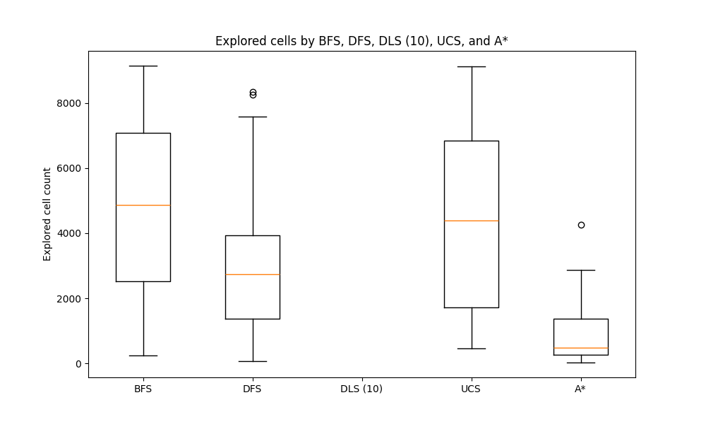
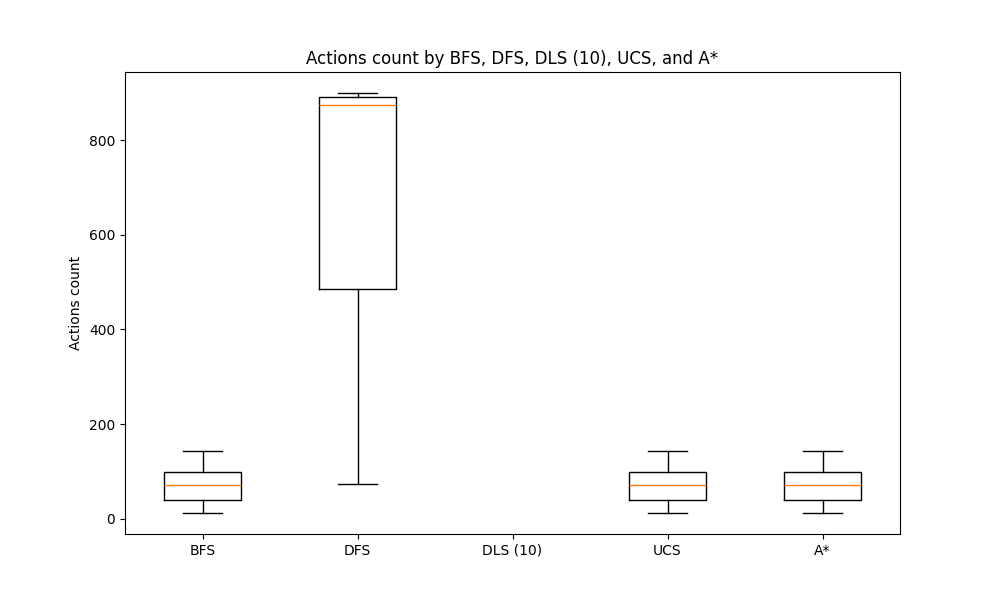
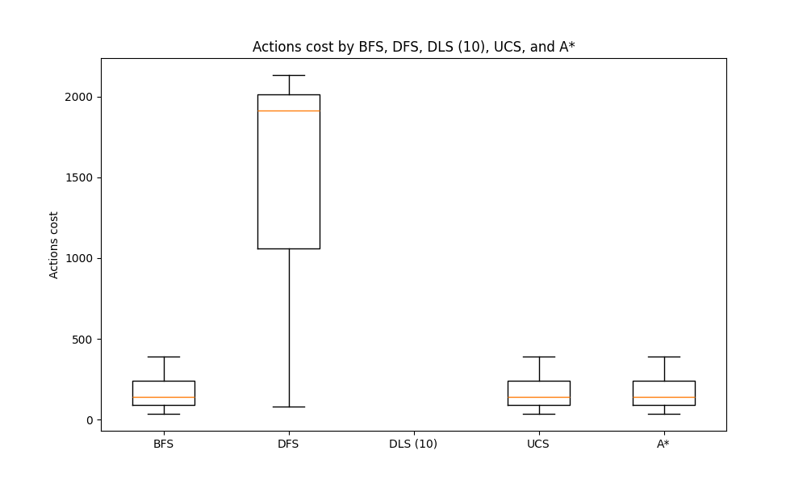
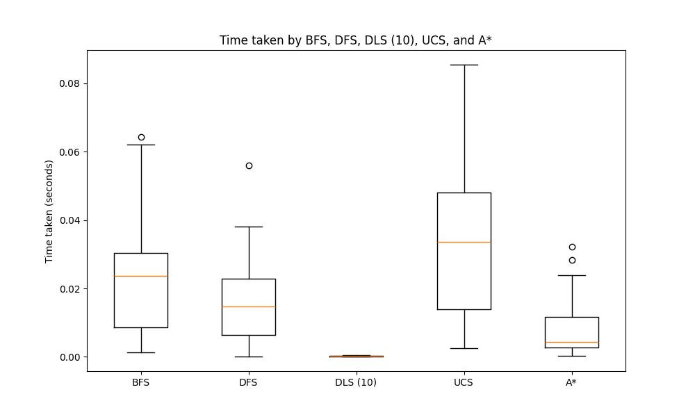

# Introducción
El objetivo de este proyecto es implementar distintos algoritmos de búsqueda no informada, definir métricas de rendimiento y realizar comparativas de las distintas medidas y resultados entre los algoritmos.

# Marco teórico y problema
Los algoritmos a implementar son los siguientes:
- **BFS (Breadth-First Search)**: Explora los nodos por niveles, comenzando desde el nodo inicial y expandiendo todos sus vecinos antes de pasar a los siguientes. Es óptimo para encontrar el camino más corto en grafos no ponderados.

- **DFS (Depth-First Search)**: Explora tan profundo como sea posible antes de retroceder. Utiliza un enfoque de pila (stack) y puede no encontrar el camino más corto en grafos no ponderados.

- **UCS (Uniform Cost Search)**: Una variante de BFS para grafos ponderados. Expande el nodo con el costo acumulado más bajo, garantizando el camino más corto si los costos son no negativos.

- **A***: Combina la búsqueda por costo con una heurística que estima el costo restante hasta la meta. Es más eficiente que UCS si la heurística es adecuada y puede encontrar el camino más corto más rápido.

# Diseño experimental
Los algoritmos a implementar son BFS, DFS, UCS y A*, los cuales se pondrán a prueba en 30 entornos, donde cada entorno es una cuadrícula de 100x100 celdas.
Existen 4 tipos de celdas:
1. **Origen**: Celda inicial.
2. **Objetivo**: Celda que debe ser alcanzada por el agente.
3. **Congeldada**: Celda que el agente puede atravezar.
4. **Agujero**: Celda que el agente no puede atravezar.

El objetivo de los algoritmos es alcanzar la celda objetivo, partiendo de la celda origen.

Los algoritmos se pondrán a prueba en 30 entornos generados de manera pseudoaleatoria. En cada entorno se ejecutan todos los algoritmos, asegurando que se pongan a prueba en entornos exactamente iguales.

La función de costo utilizada en el algoritmo UCS es el índice de la acción tomada, siendo los índices de las posibles acciones los siguientes:
- Izquierda: 1
- Abajo: 2
- Derecha: 3
- Arriba: 4

También es importante aclarar la heurística utilizada en **A***, que es la distancia rectangular o de Manhattan.

# Análisis y resultados
## Cantidad de celdas exploradas
En el siguiente gráfico se presenta la variable de celdas exploradas, que representa la cantidad de celdas analizadas por cada algoritmo para encontrar el camino al objetivo. 

Es interesante observar que BFS y UCS funcionan de manera similar debido a la función de costo seleccionada. El orden en que se seleccionan los nodos a expandir en UCS no es el mismo que en BFS, pero ambos presentan un comportamiento similar de búsqueda en anchura.
## Cantidad de acciones tomadas
Los algoritmos generan un camino desde el punto de salida hasta el objetivo. En este contexto, la cantidad de acciones tomadas son las acciones que componen el camino para llegar a dicho objetivo. 

Se puede observar que BFS, UCS y A* toman la misma cantidad de acciones, esto se debe a que los tres algoritmos son **completos** y **óptimos**.

Además se puede observar que DFS es el que más acciones toma, y esto se debe a que DFS **no es óptimo**, pero si **completo**.

## Costo de las acciones tomadas

Este gráfico es similar al anterior, pero en lugar de graficar la cantidad de acciones, se grafica el costo total de las acciones tomadas para alcanzar el objetivo.
El costo de cada acción se calcula según su índice:
- Izquierda: 1
- Abajo: 2
- Derecha: 3
- Arriba: 4

En este caso, DFS claramente tiene un costo mayor, ya que no es óptimo, a diferencia de los otros algoritmos que sí lo son.
Tanto BFS, UCS como A* tienen el mismo costo, a pesar de que, en algunas situaciones, los algoritmos toman caminos distintos. Esto se debe a la propia naturaleza del entorno rectangular. Independientemente del camino tomado, si es óptimo, los costos coinciden.

## Tiempo tomado
A continuación grafico la variable del tiempo para los algoritmos.

DFS tiene muchas aplicaciones interesantes, pero no destaca en la búsqueda de caminos por no ser óptimo. Esto significa que genera ramificaciones que se alejan rápidamente del nodo inicial, lo que explica por qué, en promedio, toma menos tiempo que BFS. BFS expande primero los nodos cercanos, y a medida que la frontera crece, recorre menos celdas, lo que lo hace menos eficiente temporalmente cuando el objetivo está lejos.
UCS toma significativamente más tiempo que BFS, debido a la necesidad de ordenar constantemente la frontera, y la función de costo seleccionada no es ideal.

# Conclusión
En función de los resultados, podemos decir que en este caso **A*** presenta una amplia superioridad en comparación con los algoritmos restantes. Es completo y óptimo, al igual que **BFS** y **UCS**, pero la gran diferencia radica en la cantidad de estados a explorar, significativamente menor, lo que implica un menor costo de procesamiento, impactando positivamente en la velocidad del algoritmo.

Los mejores algoritmos en este escenario fueron **UCS**, **BFS** y **A***, aunque la función de costos de **UCS**, en otros problemas, podría plantearse mucho mejor y, en este caso, no brinda una ventaja respecto de BFS, sino todo lo contrario.

A pesar de los resultados obtenidos con **UCS**, considero que es una opción muy buena en ciertos problemas donde la función de costos sea clara y tenga más sentido que en esta simulación.

En este problema, la definición de la heurística de **A*** es muy clara, y el algoritmo sobresale por este motivo. Sin embargo, este no siempre será el caso en otros problemas, por lo que es importante considerar **BFS** y **UCS** como alternativas.
