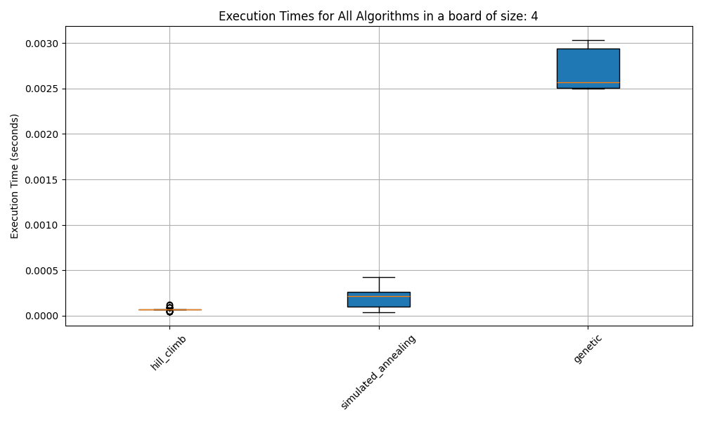
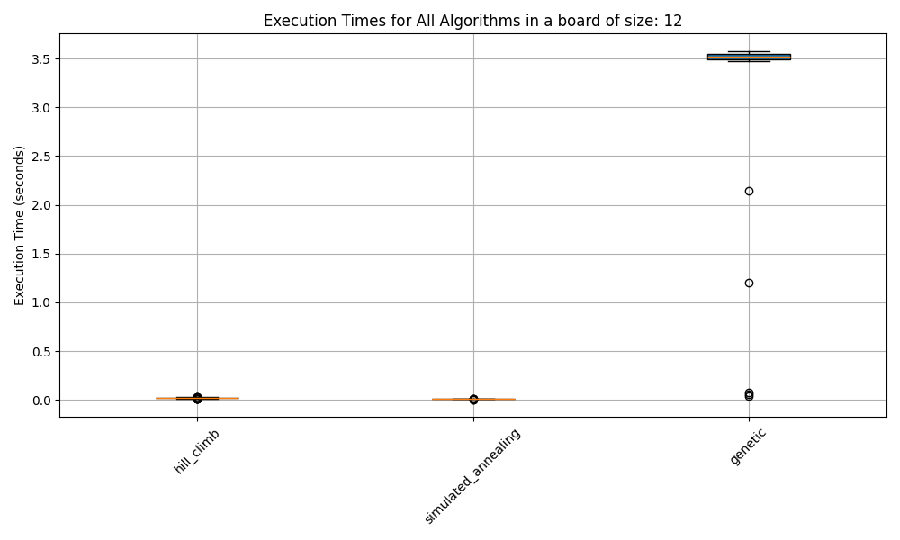
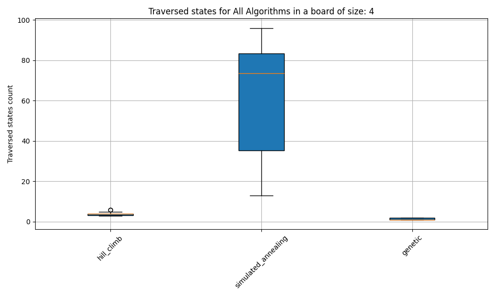
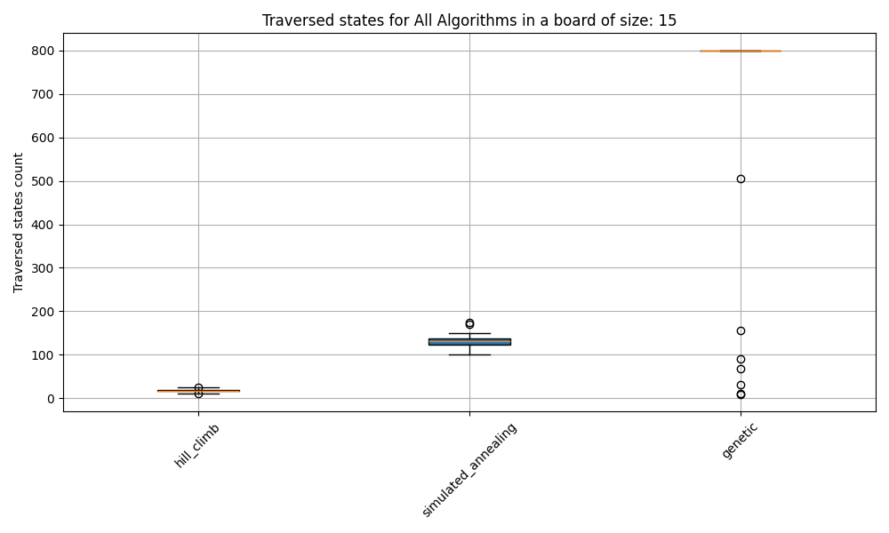
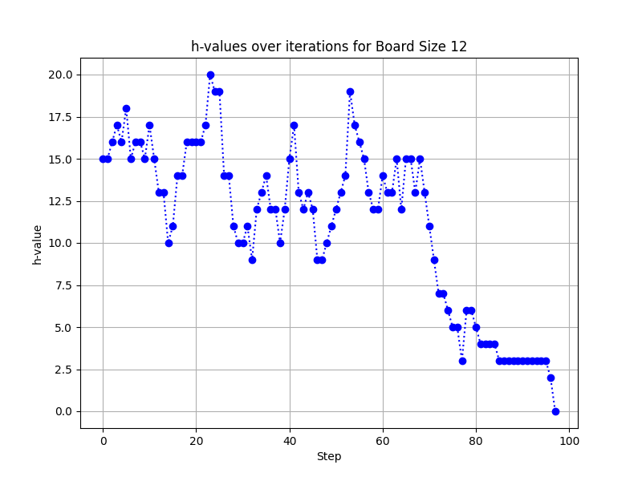
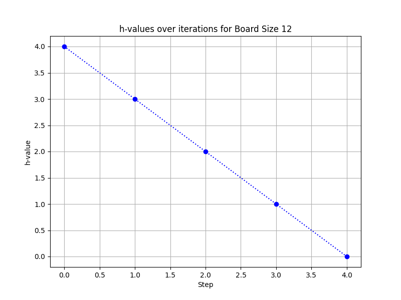

- La cantidad máxima de estados para todos los algoritmos es 800
- En simulated annealing la función de schedule es `s(t) = 100 * pow(0.95, t)`
# Tiempos de ejecucion

# Estados atravesados

# Valores de H
Las siguientes imágenes no fueron seleccionadas aleatoriamente, sinó que son los casos más cercanos al óptimo global, minimizando la cantidad de estados explorados

