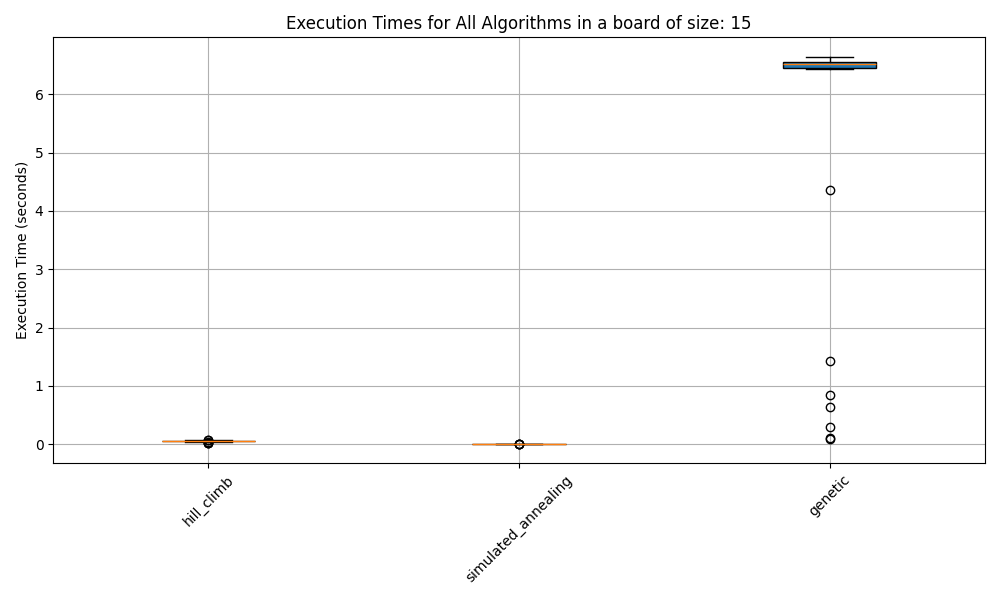
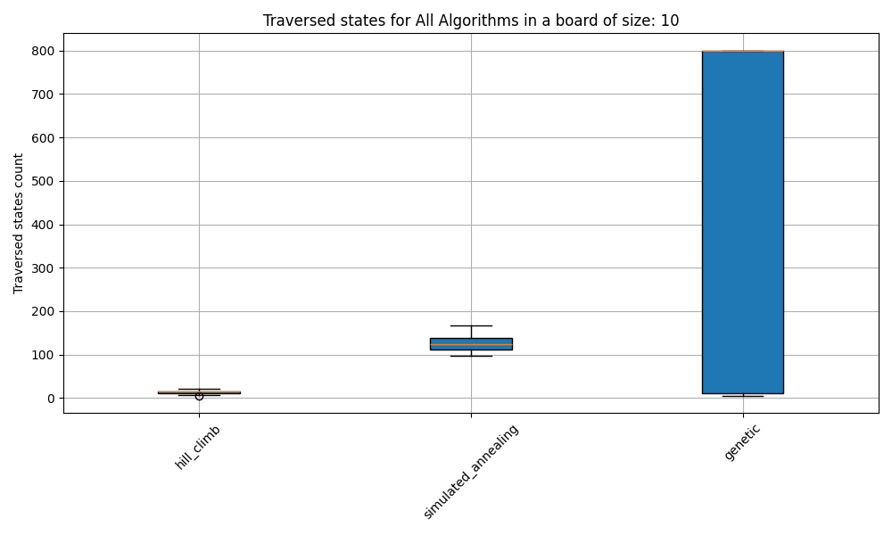

# Informe TP N° 5

## Introducción: Visión General del Problema

El problema de las N-reinas es un reto clásico en teoría computacional. Consiste en ubicar N reinas en un tablero de ajedrez de N×N de tal manera que ninguna reina amenace a otra, es decir, sin que compartan la misma fila, columna o diagonal. Resolver este problema de forma óptima implica identificar configuraciones válidas para distintos valores de N, lo cual permite evaluar la efectividad de varios algoritmos de búsqueda local, tales como Hill Climbing, Simulated annealing y algoritmos genéticos. El objetivo es hallar una solución óptima en un tiempo razonable, minimizando los conflictos entre reinas.

## Marco Teórico: Descripción General de los Algoritmos Evaluados

### Hill Climbing

Este algoritmo es una técnica de búsqueda local que inicia desde un estado y mejora la solución aplicando cambios incrementales. En cada paso, selecciona el vecino con la mejor evaluación heurística. Sin embargo, puede quedar atrapado en óptimos locales, lo cual podría impedir que encuentre la mejor solución global.

### Simulated annealing

Este es un algoritmo probabilístico que ayuda a evitar óptimos locales. Inspirado en el recocido en metalurgia, explora el espacio de soluciones aceptando inicialmente soluciones de menor calidad, lo cual permite una mayor exploración. A medida que avanza, reduce gradualmente la probabilidad de aceptar soluciones inferiores, lo que disminuye el riesgo de quedar atrapado en óptimos locales.

### Algoritmos Genéticos

Inspirados en la evolución biológica, estos algoritmos trabajan con una población de soluciones (individuos) que se someten a procesos de selección, cruzamiento y mutación. La selección favorece a los individuos más aptos (con menos conflictos en el caso de las N-reinas), mientras que la mutación y el cruzamiento facilitan la exploración de nuevas áreas del espacio de soluciones.

## Diseño Experimental: Descripción de los Experimentos

Los tres algoritmos (Hill Climbing, Simulated annealing y algoritmos genéticos) se implementaron para resolver el problema de las N-reinas en tableros de tamaño 4, 8, 10, 12 y 15. Cada algoritmo se ejecutó 30 veces por tamaño de tablero para obtener resultados consistentes.

Es importante aclarar que para todos los algoritmos se estableció un límite de estados de 800.

### Hill climbing

Para cada nodo se expanden todos los nodos vecinos, se calcula la cantidad de amenazas de reinas de cada uno y se selecciona el que cuente con menor amenazas.
Además se lleva un contador de _shoulder iterations_ usado para terminar la ejecución en caso de que ocurran más de 10 iteraciones sobre meseta.

### Simmulated annealing

A diferencia de Hill Climbing, se selecciona aleatoriamente un vecino, si este es mejor, se selecciona pero si es peor entonces se selecciona con cierta proabiliadad.
La probabiliad es calculada como:
`P = exp(-de / s(t))`
Donde `de` es la diferencia de cantidad de amenazas y `s(t)` la función de schedule que se "enfría" con el tiempo
Siendo `s(t) = 100 * pow(0.95, t)`

### Algoritmo genético

La población inicial es generada aleatoriamente, y es de tamaño constante a lo largo de todas las generaciones.
Los operadores genéticos son los siguientes:

- Selección de padres: Se utiliza **selection ranking**, lo cuál aumenta la probabilidad de que los mejores individuos sean seleccionados para el crossover, pero tambíen existe una probabilidad baja para aquellos con peor fitness, lo cuál tiene como objetivo mantener la diversidad.
- Crossover: Dados dos padres, se selecciona un punto de corte `i`, de tal modo que el hijo cuenta con las columnas `[0, i]` del padre **a** y las restantes `[i + 1, N - 1]` del padre **b**.
- Mutación: Selecciona aleatoriamente una columna del tablero y mueve la reina de esa columna a otra fila.
- Elitismo: Se mantiene el 10% de los mejores individuos de la población anterior y el resto son seleccionados aleatoriamente de la nueva generación.

Los experimentos evaluaron los siguientes aspectos clave:

- **Número de Soluciones Óptimas Encontradas:** Se registró cuántas veces cada algoritmo encontró una solución válida para cada tamaño de tablero.
- **Tiempo de Ejecución:** Se midió el tiempo promedio para alcanzar una solución, incluyendo su desviación estándar.
- **Cantidad de Estados Explorados:** Se calculó el promedio de estados explorados hasta alcanzar una solución, junto con su desviación estándar.

Se generaron gráficos de caja y bigotes (boxplots) para ilustrar la distribución de los tiempos de ejecución y los estados explorados por cada algoritmo. Además, se trazó la evolución de la función heurística H (conflictos entre reinas) a lo largo de las iteraciones en una ejecución representativa de cada algoritmo.

## Análisis de los resultados.

### Tiempos de ejecucion

Se puede observar que los tiempos de ejecución de Hill Climbing y Simulated Annealing son similares mientras que el algoritmo genético toma mucho más tiempo.

### Estados atravesados

De los tres algoritmos, el algoritmo genético requiere muchos más estados y que a medida que N aumenta, la cantidad de estados promedio tiende a 800, el cuál representa el límite de estados.

### Valores de H

Las siguientes imágenes no fueron seleccionadas aleatoriamente, sinó que son los casos más cercanos al óptimo global, minimizando la cantidad de estados explorados.

#### Hill climbing

#### Simulated annealing

#### Genetic

### Estadísticas

A continuación se presenta una tabla con los resultados y las estadísticas calculadas para cada configuración de tamaño de cada algoritmo.

| queen_count | algorithm_name      | success_rate | avg_time     | time_standard_deviation | avg_states | states_standard_deviation |
| ----------- | ------------------- | ------------ | ------------ | ----------------------- | ---------- | ------------------------- |
| 4           | hill_climb          | 1.0          | 0.0000718514 | 0.0000189931            | 4.0        | 0.8305                    |
| 8           | hill_climb          | 0.6          | 0.0023968856 | 0.0011271348            | 9.9667     | 3.9259                    |
| 10          | hill_climb          | 0.3667       | 0.0083642642 | 0.002497071             | 13.9333    | 3.6571                    |
| 12          | hill_climb          | 0.3667       | 0.0186924855 | 0.0054505591            | 15.2667    | 4.1683                    |
| 15          | hill_climb          | 0.2333       | 0.0534936746 | 0.0124655618            | 18.1       | 3.9071                    |
| 4           | simulated_annealing | 1.0          | 0.0001975775 | 0.0001019263            | 61.9333    | 25.6649                   |
| 8           | simulated_annealing | 0.6          | 0.0033010801 | 0.0013861913            | 121.1333   | 20.2088                   |
| 10          | simulated_annealing | 0.3          | 0.0056284666 | 0.001671347             | 124.8667   | 17.2362                   |
| 12          | simulated_annealing | 0.1          | 0.0082813899 | 0.0014957479            | 127.7      | 16.3563                   |
| 15          | simulated_annealing | 0.1333       | 0.0121032079 | 0.001024364             | 132.2667   | 15.8178                   |
| 4           | genetic             | 1.0          | 0.0026856581 | 0.0002091300            | 1.3667     | 0.4901                    |
| 8           | genetic             | 0.5667       | 0.5958561977 | 0.6058272087            | 370.4333   | 385.5272                  |
| 10          | genetic             | 0.4667       | 1.3054648797 | 1.0605667327            | 466.5333   | 383.5408                  |
| 12          | genetic             | 0.1667       | 3.0571871281 | 1.1273762866            | 691.1333   | 258.8646                  |
| 15          | genetic             | 0.2333       | 5.2678800027 | 2.4333495843            | 642.3333   | 301.5103                  |

# Conclusiones

Tras observar los tiempos de ejecución y la cantidad de estados explorados, al menos en esta implementación de los algoritmos, Hill Climbing muestra los resultados más eficientes. Sus tiempos de ejecución son similares a los de Simulated Annealing y aproximadamente 200 veces más rápidos que los del algoritmo genético. Además, presenta los mejores porcentajes de éxito en diversas configuraciones y, a diferencia de Simulated Annealing y el algoritmo genético, no requiere ajustar parámetros específicos para distintos tamaños de entorno, lo que le da una gran versatilidad.

Otro aspecto importante es la simplicidad de implementación. Hill Climbing es notablemente más fácil de programar en comparación con los otros algoritmos. Al no requerir ajuste de parámetros, es también más sencillo de evaluar, lo que representa una ventaja adicional frente a Simulated Annealing y los algoritmos genéticos.

Por estas razones, me inclino por Hill Climbing. Al combinarlo con _random restart_, se podrían obtener resultados significativamente mejores de forma fácil y eficiente.

Pero no quiero descartar por completo el uso de Simulated Annealing y algoritmos genéticos. Considero que los resultados de Simulated Annealing y el algoritmo genético no fueron superiores a los de Hill Climbing porque requieren fine tunning y es por este motivo que teniendo mayor tiempo para poder implementar los algoritmos serían una exelente opción.

Sin embargo, no descarto completamente el uso de Simulated Annealing y algoritmos genéticos. Considero que los resultados obtenidos para estos algoritmos no superaron a los de Hill Climbing debido a la falta de fine-tuning. Con más tiempo para ajustar adecuadamente los parámetros de ambos, podrían convertirse en opciones excelentes.

Simulated Annealing, con su capacidad de evitar óptimos locales, tiene un gran potencial en entornos más complejos. Asimismo, el algoritmo genético, a través de la selección y la evolución de soluciones, puede explorar áreas del espacio de búsqueda que Hill Climbing podría pasar por alto. Por lo tanto, una implementación con mayor refinamiento de parámetros podría mejorar notablemente los resultados de estos métodos.
