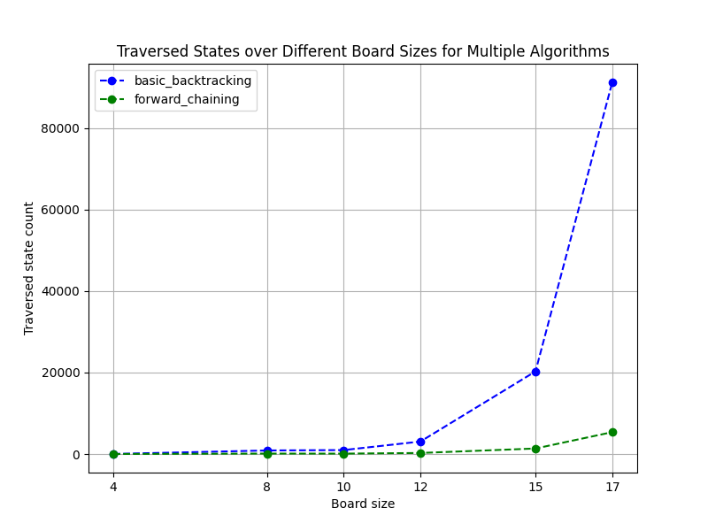
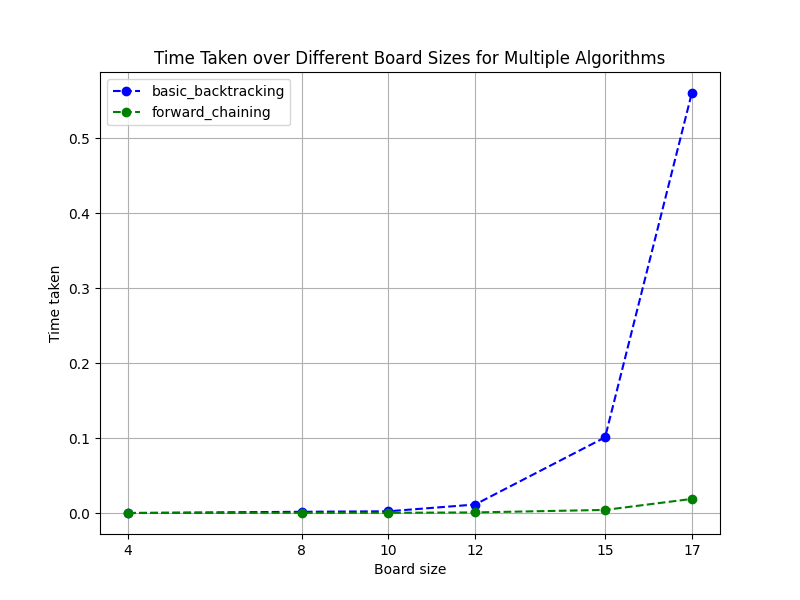

## Ejercicio 1 - CSP para Sudoku
Para todo problema de CSP se debe definir el conjunto de variables, el dominio de cada varible y las restricciones.
 - X: Conjunto de variables. Van a haber tantas varaibles como dimensión del tablero, usualmente 9x9, 81 variables
 - D: El dominio inicial de las variables es [1, 2, ..., 8, 9]
 - C: Las restricciones son las siguientes:
    1. En cada fila, todos los números son únicos.
    2. En cada columna, todos los números son únicos.
    3. En cada bloque 3x3, todos los números son únicos.


Para resolverlo, se usa el algoritmo de consistencia de arcos, **ac3**. 
Es posible resolverlo mediante este algoritmo, debido a que sudoku es un problema de satisfacción de condiciones, y solamente existe una única configuración del tablero que satisface el problema. Además, presenta una característica peculiar que lo hace perfecto para aplicar este algoritmo: Una vez que se reduce el dominio de una celda a un solo valor, entonces hemos encontrado el valor definitivo en el tablero final de la celda, siendo este el motivo principal por el cuál no resulta necesario usar backtracking.
El problema será resuelto cuando el dominio de cada una de las variables sea exáctamente 1.

En **ac3** existe el concepto de vecinos, que son nodos sobre los cuales se aplican las restricciones. En el caso de sudoku, las restricciones de un nodo se aplican sobre los otros nodos de la misma fila, misma columna y mismo bloque.

*Nota*: Por curiosidad implementé el algoritmo, y se encuentra en el archivo 
[`sudoku.py`](code/sudoku.py)
## Ejercicio 2 - Coloreo de territorios

Tras implementar el algoritmo de [`coloreo de territorios`](code/coloring/coloring_ac3.py), he comprobado que **ac3** detecta las arco inconsistencias para las asignaciones parciales de `WA = rojo` y `V = azul`

Tras ejecutar el prorama se obtiene la siguiente salida:
 ```
No solution possible...
Domains: {'WA': [0], 'NT': [2], 'SA': [1], 'Q': [], 'NSW': [0], 'V': [2], 'T': [0, 1, 2]}
```
Se puede ver que el algoritmo redujo el dominio de `Q` a un conjunto vacío, lo cuál significa que no existe una asignación completa legal, dada la asignación parcial inicial de variables y las restricciones de arco entre los países.
Nótese que `[0, 1, 2]` se mapea a `[rojo, verde, azul]`

Si `WA = rojo`, entonces, en todas las asignaciones solución del problema, `V = rojo` necesariamente.
```
Solution possible!
Domains: {'WA': [0], 'NT': [1, 2], 'SA': [1, 2], 'Q': [0, 1, 2], 'NSW': [1, 2], 'V': [0], 'T': [0, 1, 2]}
```
En este caso, tras asegurar la arco consistencia, se observa que el algoritmo redujo el dominio de los territorios `[NT, SA, NSW]`, lo cuál no significa que necesariamente exista una asignación completa legal (aunque si exista), motivo por el cuál se debería evaluar el resultado con un algoritmo de backtracking sobre los dominios reducidos.


Además implementé el algoritmo de [`backtracking`](code/coloring/coloring_backtracking.py), que toma como entrada el dominio reducido por el algoritmo **ac3**. Utilicé **ac3** para obtener una asignación parcial legal `WA = rojo` y `V = rojo`, lo cuál da como salida:
```
Reduced domains to: {'WA': [0], 'NT': [1, 2], 'SA': [1, 2], 'Q': [0, 1, 2], 'NSW': [1, 2], 'V': [0], 'T': [0, 1, 2]}
```
Posteriormente apliqué **backtracking** sobre esta asignación parcial, obteniendo el siguiente resultado:
```
{'WA': 0, 'NT': 1, 'SA': 2, 'Q': 0, 'NSW': 1, 'V': 0, 'T': 0}
```
Nótese que esta no es necesariamente la única asignación completa legal dada la asignación parcial inicial previamente mencionada. Esto se debe a que en mi implementación de **backtracking**, se retorna la primer solución encontrada, en lugar de explorar todo el espacio de soluciones.

## Ejercicio 7 - N Reinas

El problema de las N Reinas también puede plantearse como un problema de satisfacción de restricciones. En este caso se implementaron dos algoritmos, el más básico **backtracking** y **forward chaining**.
Los algoritmos son deterministas, no resulta necesario calcular estadísticas sobre muchas muestras debido a que su resultado siempre será el mismo. 

A continuación se presenta una tabla con los resultados. Cabe aclarar que *traversed_state_count*, desde un punto de vista teórico de CSP, se refiere a la cantidad de asignaciones parciales de variables.

| queen_count | algorithm_name     | traversed_state_count | time_taken (seconds)   |
|-------------|--------------------|-----------------------|------------------------|
| 4           | basic_backtracking  | 26                    | 0.000034332275390625  |
| 8           | basic_backtracking  | 876                   | 0.0016376972198486328 |
| 10          | basic_backtracking  | 975                   | 0.002308368682861328  |
| 12          | basic_backtracking  | 3066                  | 0.011328935623168945  |
| 15          | basic_backtracking  | 20280                 | 0.10103797912597656   |
| 17          | basic_backtracking  | 91222                 | 0.5606245994567871    |
| 4           | forward_chaining    | 8                     | 0.00002288818359375   |
| 8           | forward_chaining    | 113                   | 0.0002942085266113281 |
| 10          | forward_chaining    | 102                   | 0.0002691745758056641 |
| 12          | forward_chaining    | 261                   | 0.0007901191711425781 |
| 15          | forward_chaining    | 1359                  | 0.004136562347412109  |
| 17          | forward_chaining    | 5374                  | 0.018816709518432617  |


### Gráfica de estados explorados


Se puede observar que ambos algoritmos poseen un crecimiento exponencial, pero significativamente diferente.
La cantidad de estados explorados de backtracking es mucho mayor, debido a que frente a toda asignación, se debe comprobar que esta sea una asignación legal, es decir que no agreguemos reinas que se ataquen.
Pero forward chaining en cada asignación de variable, reduce el dominio de las siguientes asignaciones de variables, evitando el checkeo continuo de asignaciones legales.

### Gráfica de tiempo


La gráfica del tiempo tiene una dependencia total con la cantidad de estados explorados.


### Conclusiones
Tras analizar ambos algoritmos, **backtracking** y **forward chaining**, concluyo con total seguridad la superioridad de **forward chaining**. Esto no debería sorprender, debido a que **forward chaining** está basado en backtracking, pero es más *inteligente* a la hora de reducir los dominios de las variables, evitando el costoso checkeo de asignación que ocurre con el backtracking básico.
Pero esta diferencia no es gratuita, debido a que, por lo menos en mi implementación, la complejidad espacial se ve aumentada, ya que es necesario almacenar los dominios previos en caso de que el algoritmo entre en una rama sin solución y vuelva al estado anterior.

Si establecemos una comparativa con los algoritmos de búsqueda local implementados previamente, **hill climbing**, **simulated annealing** y **genetic**, en base a mis implementaciones, seleccionaría como ganadores a **hill climbing**, con *random restart* y principalmente a **forward chaining**, porque son fáciles de implementar, minimizan la cantidad de estados explorados, el tiempo de ejecución y no tienen una gran complejidad espacial.
