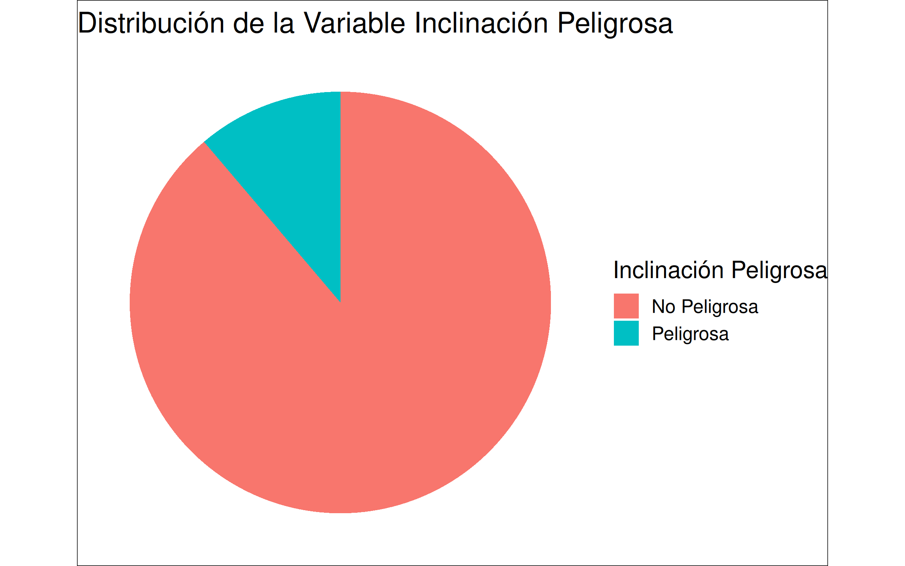
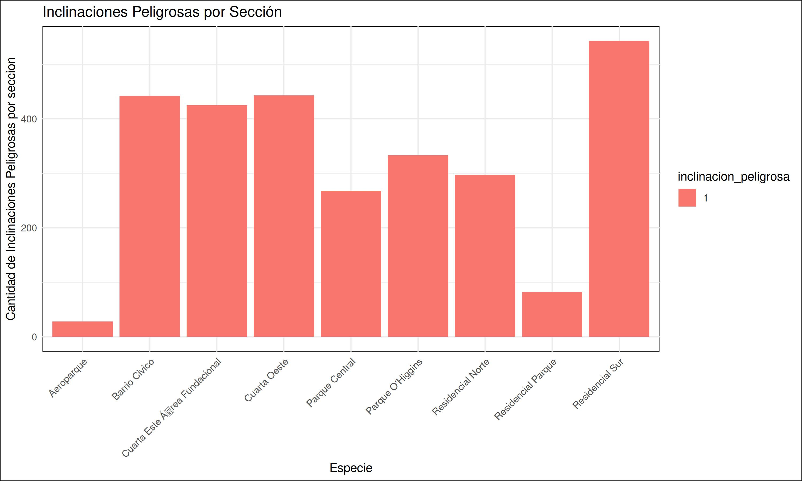
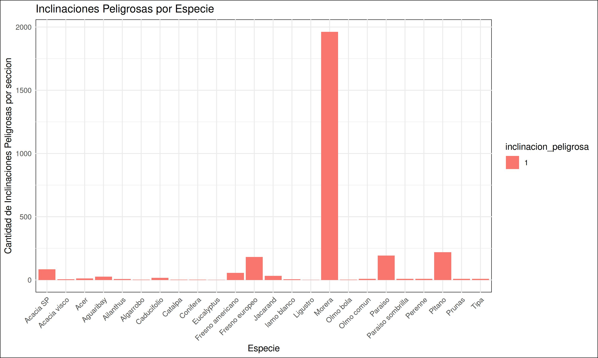
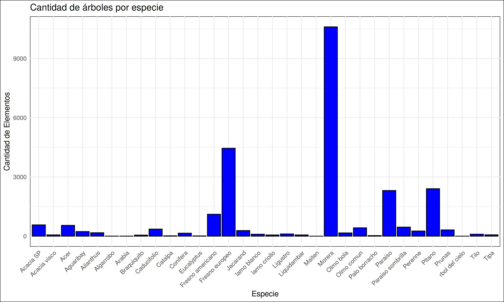
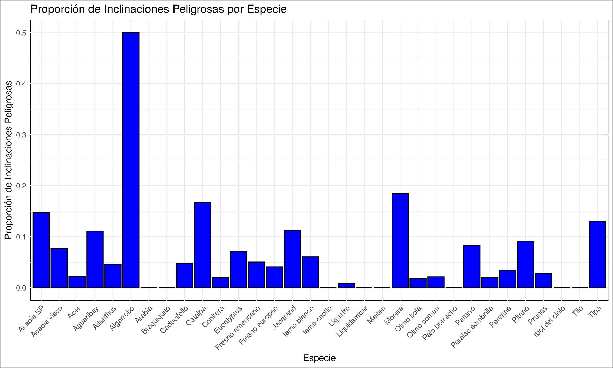
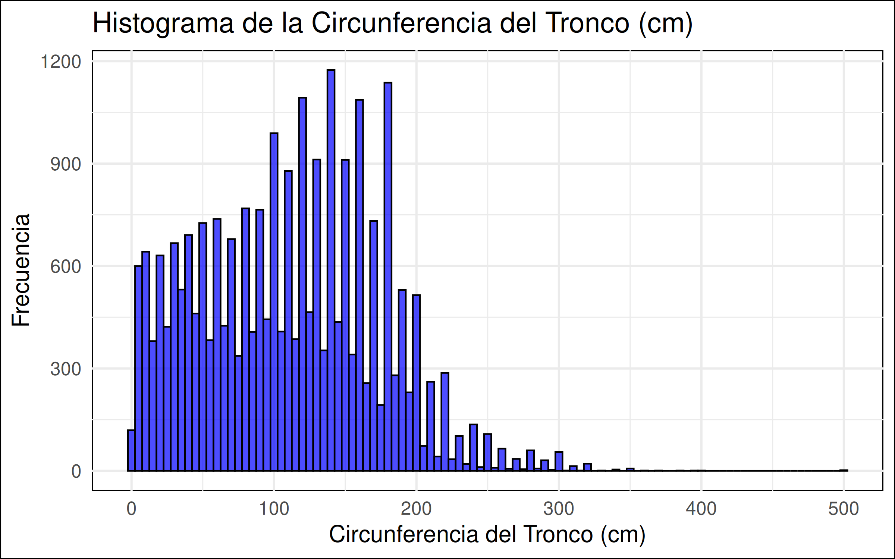
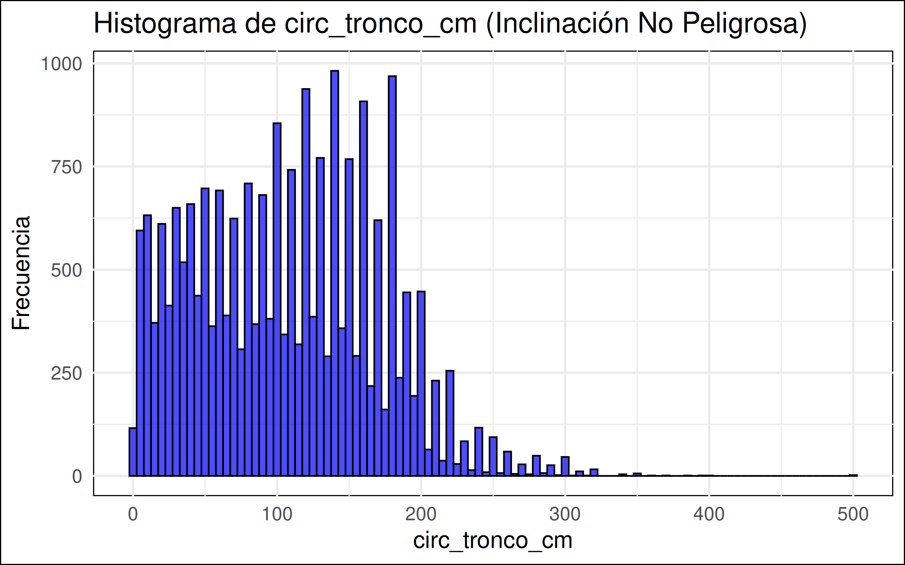
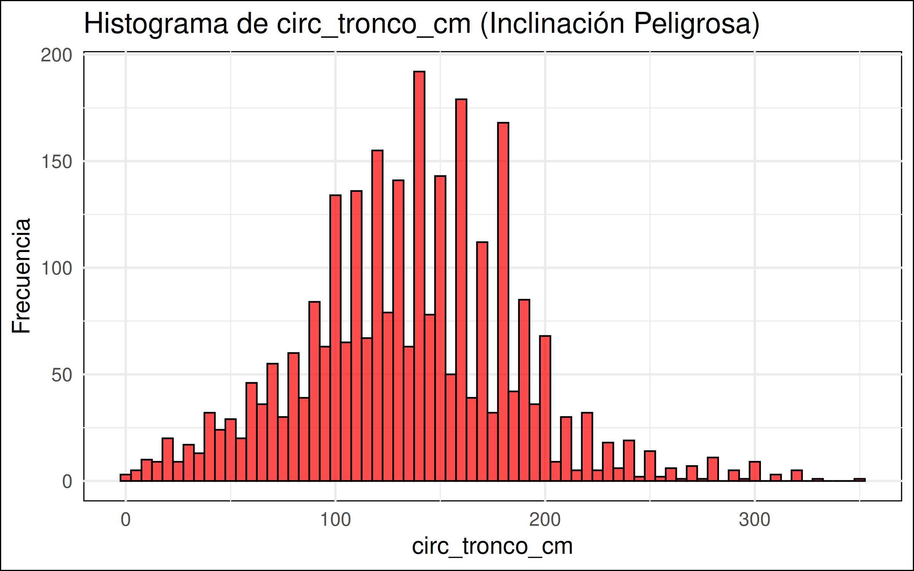

## Punto 1 y 2

Tras separar el conjunto de datos en un conjunto de entrenamiento y de validación, he realizado los siguientes gráficos a partir del conjunto de entrenamiento.

### Distribución de variable inclinación peligrosa

- No Peligrosa: 22669 (88,79%)
- Peligrosa: 2861 (11,21%)

### Sección más peligrosa

Claramente la sección más peligrosa es la residencial sur debido a que cuenta con mayor cantidad de árboles con inclinación peligrosa.

### Especie más peligrosa

Si graficamos la cantidad de inclinacione peligrosas por especie:

Tras ver esta gráfica, se puede llegar a una conclusión apresurada al decir que la Morera es el árbol más peligroso. Pero si graficamos la cantidad de árboles por especie:

Se puede observar que la Morera es el árbol más repetido, por lo que es normal que el árbol con mayor cantidad de inclinaciones peligroas sea la Morera. Es por este motivo que decidí graficar la proporción de inclinaciones peligrosas y cantidad de árboles por especie:

Se observa que el 50% de los Algarrobo presentan inclinaciones peligrosas, pero estos datos no son representativos, debido a que en nuestro conjunto de datos, contamos con muy pocos algarrobos.
Es por este motivo, que mientras mayor sea la cantidad de árboles de la especie mayor confianza tendrán los datos. Entonces puedo concluir, en función de estos datos que la Morera es el árbol más peligroso de la muestra, siendo peligroso aproximadamente el 19% de las veces.

## Punto 3

La variable _circ_tronco_cm_, es categorizada de la siguiente manera:

- Bajo [0cm, 75cm)
- Medio [75cm, 150cm)
- Alto [150cm, 225cm)
- Muy alto [225cm, infinito]

  

## Punto 4 - Clasificador aleatorio

Tras flasificar aleatoriamente a los árboles según su peligrosidad, se obtuvieron los siguientes resultados:

| Métrica                  | Valor  |
| ------------------------ | ------ |
| True Positives (TP)      | 363    |
| True Negatives (TN)      | 2829   |
| False Positives (FP)     | 2835   |
| False Negatives (FN)     | 355    |
| **n**                    | 6382   |
| **Precisión (Accuracy)** | 0.5375 |
